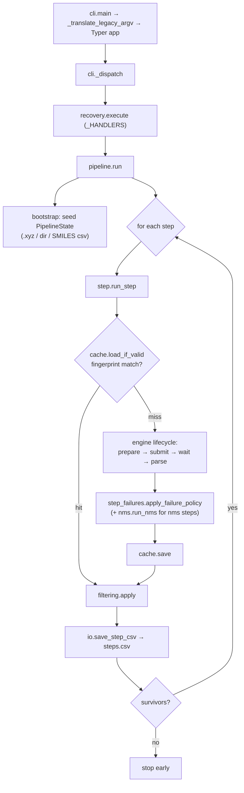

# Architecture & Code Flow

ChemRefine is layered one-directionally: the CLI dispatches a recovery action,
the pipeline iterates steps, each step drives an engine through a fixed lifecycle,
and the engine submits jobs through the SLURM/throttle machinery. State flows
forward as immutable `PipelineState` values.

## Module layering

```
cli → recovery → pipeline → step → {cache, filtering, step_failures, nms}
                                  → engines.base (Protocol + ENGINES registry)
                                       → engines/* (orca, mlip, pyscf, _fake)
                                            → slurm, throttle, io, ids, job_log, quantities
```

Only `cli` touches `sys.argv` / process exit; only `slurm` shells out to
`sbatch` / `squeue`; only `io` and `cache` own the on-disk formats. Engines
receive a focused `StepContext`, never the whole `Config`.

## Run flow

What happens when you run `chemrefine run input.yaml`:



## Submit / compute flow

Inside `engine.submit`, jobs are generated and throttled against the CPU+GPU
budget. The ExtOpt engines additionally stand up a gradient server that ORCA
talks to per optimisation step:


## Key types

- `PipelineState` — the tuple of `Structure` survivors threaded between steps.
- `Structure` — one geometry plus energy / forces / status flags; carries its
  `parent_id` so lineage (and `by_parent` filtering) is explicit.
- `StepContext` — the per-step input bundle handed to an engine.
- `StepInputs` / `JobBatch` / `StepResults` — the engine lifecycle hand-offs.

See the [API Reference](../api/index.md) for the full contracts.
