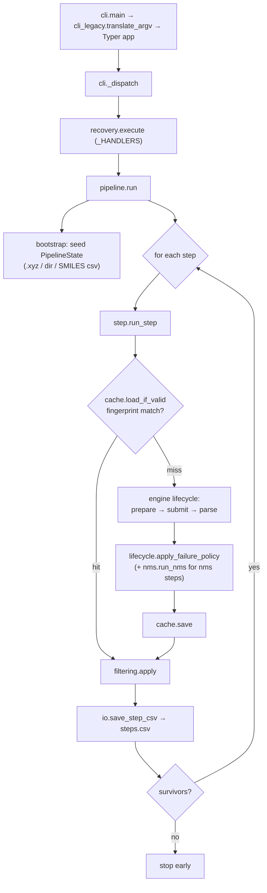
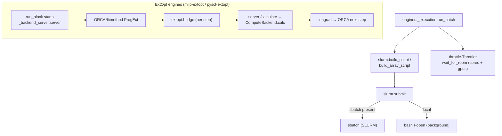

# Architecture & Code Flow

ChemRefine is layered one-directionally: the CLI dispatches a recovery action,
the pipeline iterates steps, each step drives an engine through a fixed lifecycle,
and the engine submits jobs through the SLURM/throttle machinery. State flows
forward as immutable `PipelineState` values.

## Module layering

```
cli → recovery → pipeline → step → {cache, filtering, nms}
                                  → lifecycle (run → classify → policy → persist → cache)
                                       → attempts (attemptK/ directories)
                                  → engines.api (Protocols + ENGINES registry)
                                       → engines/* (orca, mlip, pyscf)
                                            → engines/{_job, _execution, _script} (building blocks)
                                            → slurm, throttle, io, ids, job_log, quantities
```

**`engines/` does not import `cache`** — an engine turns a step's specification into a
calculation and the output back into structures; how a run is resumed and what a cache key
is made of are not its business. That edge did exist until recently: every engine had to
implement an `input_digest` the cache alone consumed. The step's template now travels on the
`StepContext` and the cache digests it there.
`test_no_engine_module_imports_the_cache` keeps the layer boundary honest, since prose does
not.

`sbatch` / `squeue` are reached only from `slurm`; `io` and `cache` own the *shared* on-disk
formats (each engine owns its own input format — that is the plugin contract). Engines
receive a focused `StepContext`, never the whole `Config`.

## Entry points

Three programs live in this package, and only the first is the pipeline:

| Entry point | Started by | What it is |
| --- | --- | --- |
| `chemrefine` (`cli:main`) | the user | the pipeline; the only one that reads `sys.argv` for a *run* or sets its exit code |
| `python -m chemrefine.engines._backend_server.server` | an ExtOpt step's job script | the gradient server ORCA's wrapper posts to |
| `chemrefine.engines.orca.extopt.bridge` | ORCA, via `%method ProgExt` | relays one `.extinp.tmp` to that server and writes back `.engrad` |

The last two run inside a job, one process per step, and exit with the job. They parse their
own argv because they are separate programs — not because the layering leaks.

## The recovery matrix

Every CLI action resolves, once, to a `RunPlan`: a default `StepMode` for the
pipeline plus per-step overrides. `pipeline.run` then asks `plan.for_step(n)` and
`step.run_step` acts on the answer — nothing re-derives it further down.

| Action | Cache invalidated first | Plan | What each step does |
| --- | --- | --- | --- |
| `run` | every step | default `EXECUTE` | every step re-runs its engine |
| `resume` | none | default `RESUME` | caches are honoured; the pending `on_failure: stop` step has its failures re-attempted |
| `rerun [N]` | step N (default: last) | default `RESUME` | step N misses its cache and re-executes end to end; the rest hit theirs |
| `rebuild-nms [N]` | step N | default `RESUME` | a named alias of `rerun`, for the NMS-tuning workflow |
| `rerun-errors [N]` | none | default `CACHE_ONLY`, `{N: RESUME}` | only step N re-attempts its pending failures; every other step is served from cache and cannot halt the run before N is reached |
| `rebuild-cache [N]` | none | default `CACHE_ONLY`, `{N: REBUILD}` | step N is re-parsed from the outputs already on disk and its cache rewritten — no submission |

The four modes:

| `StepMode` | Cache | Pending `stop` failures | Submits? |
| --- | --- | --- | --- |
| `EXECUTE` | ignored | n/a | yes |
| `RESUME` | honoured | re-attempted | only for the failures |
| `CACHE_ONLY` | honoured | left alone | no |
| `REBUILD` | rewritten | re-derived from disk | no |

`rerun` needs no mode of its own: invalidating the target's cache is enough to make
it miss and execute. The mapping is asserted end to end by
`test_recovery_matrix` — that test is the specification, and a new `Action` has to
be given a row in it.

## Run flow

What happens when you run `chemrefine run input.yaml`:



## Submit / compute flow

A `JobEngine`'s `submit` delegates to `chemrefine.engines._execution.run_batch`, which
generates jobs and throttles them against the CPU+GPU budget using the engine's
primitives (`run_block` / `pal` / `gpus` / `output_globs`). The ExtOpt engines
additionally stand up a gradient server that ORCA talks to per optimisation step:



## Key types

- `PipelineState` — the tuple of `Structure` survivors threaded between steps.
- `Structure` — one geometry plus energy / forces / status flags; carries its
  `parent_id` so lineage (and `by_parent` filtering) is explicit.
- `StepContext` — the per-step input bundle handed to an engine.
- `StepInputs` / `JobBatch` / `StepResults` — the engine lifecycle hand-offs.

See the [API Reference](../api/index.md) for the full contracts.
