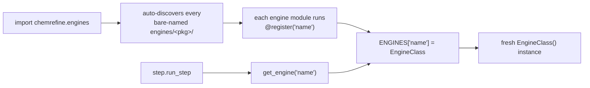

# Adding an Engine

ChemRefine's engines are a **self-contained plugin subsystem** under `chemrefine/engines/`.
chemrefine *declares* a small contract; an engine *provides* it. The whole subsystem is one
place:

- **the contract** — [`engines/api.py`](../api/engines_api.md): the `CalculationEngine` /
  `NmsCapableEngine` / `JobExecutable` Protocols, the DTOs, and the `ENGINES` registry. This is
  the only module the flat pipeline imports from `engines/`.
- **the reusable building blocks** (underscored — *compose*, never edit to add an engine):
  `_job.py` (`JobEngine`), `_execution.py` (the scheduler), `_script/` (`ScriptEngine`),
  `_backend_server/` (the ExtOpt server).
- **the plugins** (bare names) — `orca/`, `mlip/`, `pyscf/`.

Adding an engine touches exactly **one** thing: a new bare-named `engines/<name>/` package.
Plugins are auto-discovered — every bare-named subpackage is imported when
`chemrefine.engines` loads, so the addition is fully self-contained. You never edit a building
block (or any central list) to make a new engine exist.

## The steps

Adding an engine is the same handful of moves every time. Walk them in order — each has a section
below with the detail, and the [worked example](#worked-example-a-minimal-engine) at the end
strings them into one engine you can read top to bottom:

1. **Scaffold the package** — make `engines/<name>/` with `engine.py`, `options.py`, and an
   `__init__.py`.
2. **Pick a kind and write `engine.py`** — choose the base whose shape matches your backend
   ([Pick a kind](#pick-a-kind-and-provide-its-pieces)), decorate the class with
   `@register("<name>")`, declare its [ClassVars](#declare-the-metadata-classvars), and implement
   only the primitives that kind asks for.
3. **Validate the YAML knobs** in `options.py` ([Validate the YAML knobs](#validate-the-yaml-knobs)).
4. **Register it** — [one import line in *your own* `__init__.py`](#wire-registration); the
   package itself is auto-discovered.
5. **Wire resources** — a binary path or an optional `pip` extra ([Resources](#resources)).
6. **Support NMS** only if the engine computes frequencies ([Supporting NMS](#supporting-nms)).
7. **Add tests and a contract fixture** ([Tests](#tests)).

The sections that follow are those steps in detail.

## Pick a kind and provide its pieces

Decorate the class with `@register("<name>")` and choose the **kind** that matches the backend:

| Kind | Base | You provide |
|------|------|-------------|
| Per-structure program (own input format) | [`JobEngine`](../api/engines_job.md) | `build_input`, `run_block`, `parse_one`, `pal`, `gpus` + the ClassVars (`label` / `template_suffix` / `output_suffix` / `output_globs`) |
| User Python script | [`ScriptEngine`](../api/engines_job.md) (a `JobEngine`) | usually only `_vars_from` (inject `$VAR`s from `step.options`) |
| ORCA optimises using *this* engine's gradients | `ExtOptOrcaEngine` | the ClassVars `backend` / `wrapper_filename` / `options_cls` / `calculator_cls`, plus a `ComputeBackend` in `extopt_calc.py` |
| Not a per-structure job (e.g. a training step) | `CalculationEngine` directly | `prepare` / `submit` / `parse` |

A `JobEngine` provides only **primitives** — the public provision surface chemrefine requests
(`build_input` / `run_block` / `parse_one` / `pal` / `gpus`, the `JobExecutable` contract). The
base owns the lifecycle: `submit` delegates to `engines._execution.run_batch` (the scheduler),
and `parse` feeds `build_structures`, which mints child IDs + lineage. Every `JobEngine`
*templates* — ORCA's input is a `.inp`, a `ScriptEngine`'s is a `.py`; that's the `build_input`
step, not an engine-specific feature.

## Declare the metadata ClassVars

`name`, plus the base-required ClassVars (`label`, `template_suffix`, `output_suffix`,
`output_globs`), as `ClassVar[...]` annotations matching the other engines. There is no
`supports_nms` flag — NMS is a *capability* (below), detected via `isinstance`.

## Validate the YAML knobs

Add a Pydantic model in `engines/<name>/options.py` subclassing
[`EngineOptions`](../api/engines_api.md) (it carries the shared `device` field + frozen /
`extra="forbid"` config + `from_raw`); add your own fields and read it in the primitives. This
keeps `step.options` a free dict at the orchestrator level while giving the engine typed
validation.

## Wire registration

Registration is an **import side effect** of `@register("<name>")`, and discovery is automatic:
importing `chemrefine.engines` imports every bare-named subpackage under `engines/`. The only
wiring you write is inside your own package — import the class in `engines/<name>/__init__.py`
so the discovery import runs your decorator:



```python
# engines/<name>/__init__.py
from chemrefine.engines.<name>.engine import MyEngine

__all__ = ["MyEngine"]
```

Nothing outside `engines/<name>/` changes — underscored packages (building blocks) and plain
modules are never treated as plugins. Legacy YAML engine spellings are rewritten to the
canonical name by `config_legacy.normalize` (the single place that knows the legacy
vocabulary) — never the registry.

## Resources

An external binary reads its path from `ctx.executables.get("<name>")`. An importable backend
ships as a `pip install chemrefine[<name>]` extra and is imported **lazily** (inside the function
that needs it) so the package imports cleanly when the optional dependency is absent — declare
the extra + pip package + import name at registration so a missing library reports the extra to
install (see `mlip.calculator.register_backend`).

## The lifecycle

Whatever kind you pick, the engine satisfies the contract the step lifecycle drives in order.
That contract is three methods and mentions caching nowhere: how a run is resumed is the
orchestrator's business, not an engine's. `submit` blocks until the jobs finish, so there is no
separate `wait`:

```
prepare → submit → parse
```

## Supporting NMS

Normal-mode sampling is **engine-independent**: the two-round algorithm lives in
`chemrefine.nms`. NMS is a capability, not a flag — implement the
[`NmsCapableEngine`](../api/engines_api.md) Protocol's one hook and populate two structure
fields; capability is detected with `isinstance` (the ExtOpt engines get it for free from ORCA):

- `nms_input_info(ctx) -> NmsInputInfo` — introspect the step's input (is it a TS search? does it
  compute frequencies?), driving the default target and the freq gate.
- set `imaginary_freqs` (mode → cm⁻¹) and `normal_modes` (the displacement tensor) on each parsed
  `Structure`, in the *same* pass that reads geometry/energy — NMS reads them off the structure, so
  there is no separate output-reading hook and the file is parsed once.

Everything else — displacement, round-2 submission, resolution, retry — is generic.

## Tests

Add `tests/test_engines_<name>*.py`, mirroring the existing engine tests. New code ships at 100%
line+branch coverage with a docstring on every public symbol.

The suite is tiered: unit tests (hermetic), **recorded** end-to-end tests that replay real
outputs without any binary installed, and **live** integration tests (`pytest -m integration`,
deselected by default) that run the real binaries and re-record the fixtures with `--record`.

### The parsed-result contract

Every engine's parse lands in one canonical, engine-independent record —
`chemrefine.cache.structure_record` is the normative schema (energies in Hartree, forces in
eV/Å, positions in Å, run-status flags, string-keyed imaginary modes). The pipeline writes it
as `step{N}_{id}.result.json` beside every parsed output, whatever native format the backend
produced.

A new engine **must ship at least one contract case** under
`tests/data/engines/<name>/<case>/`: a *shortened real* native output (trim it to the blocks
your parser reads), the seed geometry (`step1_0_inp.xyz`), a `case.json` meta, and the golden
`expected.json`. Generate the golden with

```bash
pytest tests/test_engines_contract.py --update-goldens
```

and review the diff. The suite fails until every registered engine ships a case
(`test_every_registered_engine_ships_a_contract_case`).

## Worked example: a minimal engine

To see the steps as one unit, here is a complete *illustrative* engine — `demoqm`, a fictional
quantum-chemistry program with its own `.inp` format and a `demoqm` binary. It's a `JobEngine`
(one job per structure, its own input file). This code is **not shipped** — don't look for
`engines/demoqm/` — but every signature matches the real base, so it reads exactly like the
shipped `orca/`.

The package is three files:

```text
engines/demoqm/
  __init__.py     # registration import
  engine.py       # the engine + its primitives
  options.py      # the YAML knobs
```

**Step 1 + 3 — `options.py`** validates `step.options`, reusing the shared `device` field and
frozen config from `EngineOptions`:

```python
from __future__ import annotations

from pydantic import Field

from chemrefine.engines._options import EngineOptions


class DemoqmOptions(EngineOptions):
    """Validated ``step.options`` for the demoqm engine."""

    basis: str = Field("sto-3g", min_length=1)
    """Orbital basis set, written into the input."""
```

**Step 2 — `engine.py`** picks `JobEngine`, declares the ClassVars, and implements only the
per-structure primitives (`prepare` / `submit` / `parse` come from the base — you don't write them):

```python
from __future__ import annotations

from pathlib import Path
from typing import ClassVar

from chemrefine.engines._job import JobEngine
from chemrefine.engines.api import ParsedResult, register
from chemrefine.engines.demoqm.options import DemoqmOptions
from chemrefine.state import StepContext


@register("demoqm")
class DemoqmEngine(JobEngine):
    """Illustrative QM engine: runs the ``demoqm`` binary once per structure."""

    name: ClassVar[str] = "demoqm"
    label: ClassVar[str] = "DemoQM"
    template_suffix: ClassVar[str] = "inp"  # input-file extension
    output_suffix: ClassVar[str] = "out"  # output-file extension
    output_globs: ClassVar[tuple[str, ...]] = ("*.out",)

    def build_input(
        self,
        *,
        xyz_path: Path,
        template_path: Path,
        input_path: Path,
        output_path: Path,
        ctx: StepContext,
    ) -> None:
        """Render this structure's ``.inp`` from the step template + its geometry."""
        opts = DemoqmOptions.from_raw(ctx.step_cfg.options)
        body = template_path.read_text(encoding="utf-8")
        input_path.write_text(
            body.replace("$BASIS", opts.basis).replace("$XYZ", xyz_path.name),
            encoding="utf-8",
        )

    def pal(self, ctx: StepContext) -> int:
        """Cores per job, before the scheduler clamps it to ``max_cores``."""
        return 1

    def run_block(self, ctx: StepContext, inp_path: Path, out_path: Path) -> str:
        """The bash that runs inside the job's work dir."""
        demoqm = ctx.executables.get("demoqm", "demoqm")
        return f"{demoqm} {inp_path.name} > $OUTPUT_DIR/{out_path.name}"

    def parse_one(
        self, output_path: Path, structure_id: str, ctx: StepContext
    ) -> list[ParsedResult]:
        """Parse one ``.out`` into a ``ParsedResult`` (return ≥2 to fan out to an ensemble)."""
        text = output_path.read_text(encoding="utf-8", errors="replace")
        symbols, positions, energy = _read_demoqm_out(text)  # your regexes; cf. engines/orca/output/
        return [
            ParsedResult(
                symbols=symbols,
                positions=positions,
                energy_hartree=energy,
                forces_ev_per_a=None,
                terminated_normally=True,
            )
        ]
```

`gpus` defaults to `0` (CPU); a GPU engine overrides it.

**Step 4 — register** with your own `__init__.py` — the bare-named package is auto-discovered,
so nothing outside `engines/demoqm/` changes:

```python
# engines/demoqm/__init__.py
from chemrefine.engines.demoqm.engine import DemoqmEngine

__all__ = ["DemoqmEngine"]
```

That's a working engine: `engine: demoqm` in a step now renders `step{N}.inp` per structure, runs
`demoqm`, and parses each result back into the pipeline.

For the real, shipped versions to copy: **`orca/`** is the `JobEngine` for an own-input-format
program; **`pyscf/`** is a `ScriptEngine` (it overrides only `_vars_from`); **`mlip/`** adds a
backend server. A library-only backend (e.g. a future `tblite` engine) is a `ScriptEngine` or a
`_backend_server` backend — not a binary wrapper like this one.

See the [Engine Contract & Registry API](../api/engines_api.md) for the exact signatures, and
[Architecture & Code Flow](../concepts/architecture.md) for where the lifecycle sits in the run.
