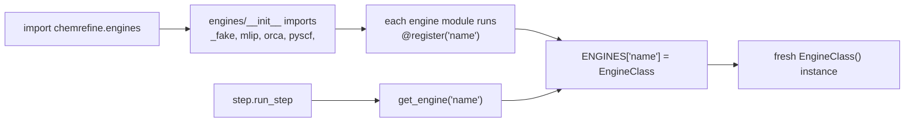

# Adding an Engine

ChemRefine's engines are a **self-contained plugin subsystem** under `chemrefine/engines/`.
chemrefine *declares* a small contract; an engine *provides* it. The whole subsystem is one
place:

- **the contract** — [`engines/api.py`](../api/engines_api.md): the `CalculationEngine` /
  `NmsCapableEngine` / `JobExecutable` Protocols, the DTOs, and the `ENGINES` registry. This is
  the only module the flat pipeline imports from `engines/`.
- **the reusable building blocks** (underscored — *compose*, never edit to add an engine):
  `_job.py` (`JobEngine`), `_execution.py` (the scheduler), `_script/` (`ScriptEngine`),
  `_backend_server/` (the ExtOpt server).
- **the plugins** (bare names) — `orca/`, `mlip/`, `pyscf/`.

Adding an engine touches exactly two things: a new `engines/<name>/` package, and one line in
`engines/__init__.py`'s import list. You never edit a building block to make a new engine exist.

## Pick a kind and provide its pieces

Decorate the class with `@register("<name>")` and choose the **kind** that matches the backend:

| Kind | Base | You provide |
|------|------|-------------|
| Per-structure program (own input format) | [`JobEngine`](../api/engines_job.md) | `build_input`, `run_block`, `parse_one`, `pal`, `gpus` + the ClassVars (`label` / `template_suffix` / `output_suffix` / `output_globs`) |
| User Python script | [`ScriptEngine`](../api/engines_job.md) (a `JobEngine`) | usually only `_template_vars` (inject `$VAR`s from `step.options`) |
| ORCA optimises using *this* engine's gradients | `ExtOptOrcaEngine` | the ClassVars `backend` / `wrapper_filename` / `options_cls` / `calculator_cls`, plus a `ComputeBackend` in `extopt_calc.py` |
| Not a per-structure job (e.g. a training step) | `CalculationEngine` directly | `prepare` / `submit` / `parse` + `input_digest` |

A `JobEngine` provides only **primitives** — the public provision surface chemrefine requests
(`build_input` / `run_block` / `parse_one` / `pal` / `gpus`, the `JobExecutable` contract). The
base owns the lifecycle: `submit` delegates to `engines._execution.run_batch` (the scheduler),
and `parse` feeds `build_structures`, which mints child IDs + lineage. Every `JobEngine`
*templates* — ORCA's input is a `.inp`, a `ScriptEngine`'s is a `.py`; that's the `build_input`
step, not an engine-specific feature.

## Declare the metadata ClassVars

`name`, plus the base-required ClassVars (`label`, `template_suffix`, `output_suffix`,
`output_globs`), as `ClassVar[...]` annotations matching the other engines. There is no
`supports_nms` flag — NMS is a *capability* (below), detected via `isinstance`.

## Validate the YAML knobs

Add a Pydantic model in `engines/<name>/options.py` subclassing
[`EngineOptions`](../api/engines_api.md) (it carries the shared `device` field + frozen /
`extra="forbid"` config + `from_raw`); add your own fields and read it in the primitives. This
keeps `step.options` a free dict at the orchestrator level while giving the engine typed
validation.

## Wire registration

Registration is an **import side effect** of `@register("<name>")`. Import the class in
`engines/<name>/__init__.py`, then add the package to `engines/__init__.py`'s import list:



```python
# engines/<name>/__init__.py
from chemrefine.engines.<name>.engine import MyEngine

__all__ = ["MyEngine"]
```

```python
# engines/__init__.py  (add <name> to the import + __all__)
from chemrefine.engines import _fake, mlip, orca, pyscf, <name>
```

Legacy YAML engine spellings are rewritten to the canonical name by `config._normalize_legacy`
(the single place that knows the legacy vocabulary) — never the registry.

## Resources

An external binary reads its path from `ctx.executables.get("<name>")`. An importable backend
ships as a `pip install chemrefine[<name>]` extra and is imported **lazily** (inside the function
that needs it) so the package imports cleanly when the optional dependency is absent — wrap the
import so a missing library reports the extra to install (see `mlip.calculator.optional_backend`).

## The lifecycle

Whatever kind you pick, the engine satisfies the contract the step lifecycle drives in order
(plus `input_digest`, folded into the cache fingerprint). `submit` blocks until the jobs finish,
so there is no separate `wait`:

```
prepare → submit → parse
```

## Supporting NMS

Normal-mode sampling is **engine-independent**: the two-round algorithm lives in
`chemrefine.nms` and drives any engine through *two* hooks. NMS is a capability, not a flag —
implement the [`NmsCapableEngine`](../api/engines_api.md) Protocol's two methods and capability
is detected with `isinstance` (the ExtOpt engines get it for free by inheriting ORCA's hooks):

- `nms_input_info(ctx) -> NmsInputInfo` — introspect the step's input (is it a TS search? does it
  compute frequencies?), driving the default target and the freq gate.
- `read_frequencies(structure_id, step_dir, ctx) -> FrequencyData` — read a structure's imaginary
  frequencies + normal-mode tensor from its output.

Everything else — displacement, round-2 submission, resolution, retry — is generic.

## Tests

Add `tests/test_engines_<name>*.py`, mirroring the existing engine tests. New code ships at 100%
line+branch coverage with a docstring on every public symbol.

See the [Engine Contract & Registry API](../api/engines_api.md) for the exact signatures, and
[Architecture & Code Flow](../concepts/architecture.md) for where the lifecycle sits in the run.
