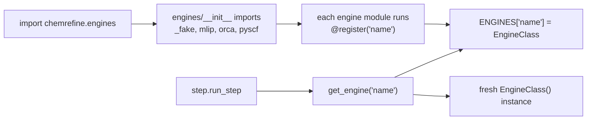

# Adding an Engine

ChemRefine's engines are **plugins**. The orchestrator only ever sees the
`CalculationEngine` Protocol and the `ENGINES` registry — it never imports a
concrete engine. Adding one is a self-contained package plus a single import line;
no edit to a god-class.

This page expands the recipe that lives in
[`engines/base.py`](../api/engines_base.md).

## How registration works

Registration is an **import side effect**. Each engine class is decorated with
`@register("<name>")`, which inserts it into the `ENGINES` dict. Importing
`chemrefine.engines` imports every bundled engine package, so by the time the
pipeline calls `get_engine(name)` the registry is fully populated.



So an engine becomes usable once (a) its class is decorated with `@register` and
(b) its package is imported from `engines/__init__.py`.

## Step-by-step

Everything engine-specific lives in a new `engines/<name>/` package; shared,
engine-neutral infrastructure stays in `engines/` (the Protocol, the SLURM batch
base, the template renderer, the `_backend_server` gradient service).

### 1. Pick a base for `engines/<name>/engine.py`

Decorate the class with `@register("<name>")` and choose the base that matches
the backend's shape:

| Backend shape | Base class | You implement |
|---------------|-----------|---------------|
| User supplies a `step{N}.py` run per structure | `TemplateScriptEngine` | only `_template_vars` (inject `$VAR`s from `step.options`) |
| A real binary / custom SLURM job | `SlurmBatchEngine` | `prepare`, `parse`, `_pal`, `_run_block` + the ClassVars |
| ORCA optimises using *this* engine's gradients | `ExtOptOrcaEngine` | `_server_cmd` + the `backend` / `wrapper_filename` ClassVars, plus a `ComputeBackend` in `extopt_calc.py` |
| Local / orchestration-only (no SLURM compute) | implement the `CalculationEngine` Protocol directly | the five lifecycle methods |

### 2. Declare the metadata ClassVars

`name` and `supports_nms`, plus any base-required ClassVars (`label`,
`template_suffix`, `output_globs`), as `ClassVar[...]` annotations matching the
other engines.

### 3. Validate the YAML knobs

Add a Pydantic model in `engines/<name>/options.py` with a `from_raw` classmethod
(mirror `engines/mlip/options.py` / `engines/pyscf/options.py`), and read it in
`prepare` / `_template_vars`. This keeps `step.options` a free dict at the
orchestrator level while giving the engine typed, `extra="forbid"` validation.

### 4. Wire registration

Import the class in `engines/<name>/__init__.py`, then list the package in
[`engines/__init__.py`](../api/engines_base.md) — the import is what registers it.

```python
# engines/<name>/__init__.py
from chemrefine.engines.<name>.engine import MyEngine

__all__ = ["MyEngine"]
```

```python
# engines/__init__.py  (add <name> to the import + __all__)
from chemrefine.engines import _fake, mlip, orca, pyscf, <name>
```

### 5. Legacy spellings go in the normalizer, not the registry

The registry stays alias-free. Old YAML engine names are rewritten to the
canonical name by `config._normalize_legacy` — the single place that knows the
legacy vocabulary.

### 6. Resources

An external binary reads its path from `ctx.executables.get("<name>")`. An
importable backend ships as a `pip install chemrefine[<name>]` extra and is
imported **lazily** (inside the function that needs it) so the package imports
cleanly when the optional dependency is absent — wrap the import so a missing
library reports the extra to install (see `mlip.calculator.optional_backend`).

### 7. Tests

Add `tests/test_engines_<name>*.py`, mirroring the existing engine tests. New code
ships at 100% line+branch coverage with a docstring on every public symbol.

## The lifecycle

Whatever base you pick, the engine satisfies the five-stage contract the step
lifecycle drives in order:

```
prepare → submit → wait → parse → (normal_mode_sample, if supports_nms)
```

See the [Engine Contract & Registry API](../api/engines_base.md) for the exact
signatures, and [Architecture & Code Flow](../concepts/architecture.md) for where
the lifecycle sits in the run.
