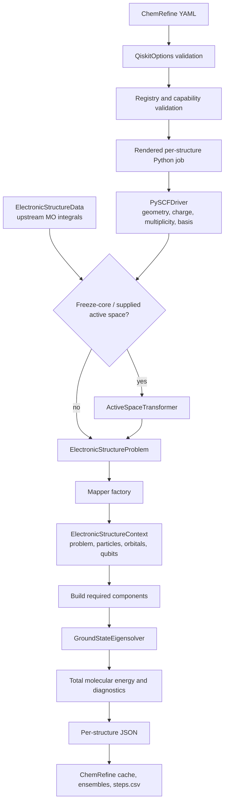
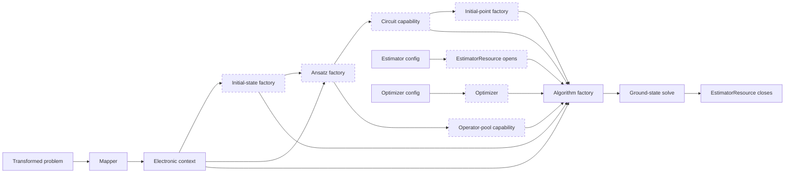
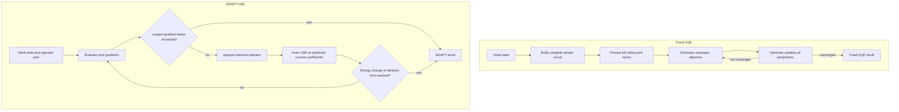

# Qiskit ground-state calculations

ChemRefine's `qiskit` engine runs modular electronic-structure ground-state
calculations with Qiskit Nature. A step chooses the mapper, algorithm, ansatz,
initial state, estimator, sampler, optimizer, and initial point independently. Changing
from exact diagonalization to VQE or ADAPT-VQE is therefore a configuration
change, not a new step template.

The built-in workflow is intended for small active spaces, algorithm studies,
and reproducible local simulation. It currently performs **single-point energy
calculations**. It does not optimize geometries or return nuclear gradients.
The Python API also accepts molecular-orbital integrals directly, so the solver
pipeline does not depend on one classical electronic-structure program.

The optional fermionic research stack also supplies UCJ/LUCJ simulation, SQD,
experimental SqDRIFT, and a separate Python API for lattice dynamics. See
[Fermionic research workflows](#fermionic-research-workflows) below for supported
combinations and limitations. Availability is explicit; the toolkit does not
claim to implement every published quantum algorithm.

`chemrefine schema` publishes each component's option schema, requirements,
provider profile, research `status`, and `supported_domains` without loading a
quantum SDK. `experimental` marks research implementations whose supported
domains and numerical tests are documented; successful execution does not certify
chemical accuracy. An empty domain list means no structured domain declaration,
not universal applicability. The [spectra](qiskit-spectra.md),
[sampled-state](qiskit-states.md), [local-encoding](qiskit-encodings.md) and
[experiment](qiskit-experiment.md) pages give method-specific limitations.

## Install and run the example

Install the optional stack in the current environment:

```bash
pip install "chemrefine[qiskit]"
# Add Aer when selecting aer_statevector or aer_shots:
pip install "chemrefine[qiskit-aer]"
# UCJ/LUCJ, SQD, SqDRIFT and lattice dynamics:
pip install "chemrefine[qiskit-fermionic]"
```

Alternatively, keep it in an isolated ChemRefine-managed environment:

```bash
chemrefine backends install qiskit
# Or install the Aer-capable environment:
chemrefine backends install qiskit-aer
chemrefine backends install qiskit-fermionic
chemrefine backends list
```

The `[qiskit-core]` extra installs compatible Qiskit, Qiskit Nature, and Qiskit
Algorithms versions for integral-input calculations. `[qiskit]` adds PySCF for
the XYZ adapter and shipped CLI examples. `[qiskit-aer]` adds the compatible CPU Aer
distribution. See [Installation](installing.md#qiskit-nature) for the exact
supported ranges, source-install commands, and separate Linux GPU-package
guidance. ChemRefine resolves exact/reference/basic steps to the `qiskit`
managed backend and Aer steps to `qiskit-aer`.

A complete H2 VQE example is shipped at
`examples/tutorials/qiskit_sp/`:

```bash
cd examples/tutorials/qiskit_sp
chemrefine run input.yaml --dry-run
chemrefine run input.yaml
# Compare exact, UCCSD-VQE, and ADAPT-VQE on one prepared H2 problem:
chemrefine run compare.yaml --dry-run
chemrefine run compare.yaml
# Aer variants (after installing chemrefine[qiskit-aer]):
chemrefine run aer_statevector.yaml
chemrefine run aer_shots.yaml
```

The important files are:

```text
examples/tutorials/qiskit_sp/
├── input.yaml
├── compare.yaml
├── aer_statevector.yaml
├── aer_shots.yaml
├── h2.xyz
└── templates/
    ├── step1.py
    ├── compare.py
    └── cpu.slurm.header
```

`templates/step1.py` is deliberately thin:

```python
import json

from chemrefine.engines.qiskit.workflow import run_job

result = run_job(
    "$XYZ_PATH",
    charge=int("$CHARGE"),
    multiplicity=int("$MULTIPLICITY"),
    options=json.loads("$OPTIONS_JSON"),
)

energy_hartree = result.energy_hartree
engine_metadata = result.as_metadata()
if result.converged is not None:
    converged = result.converged
```

The scientific choices belong in YAML. Keep this template unless you are
registering project-specific components or deliberately changing the output
contract.

`compare.yaml` uses the same CLI and output conventions. Its template prepares
H2 once, solves all three algorithms against that problem, and records their
energies, errors, and resource metrics under `engine_metadata.comparison`.
The final ADAPT energy is the canonical pipeline energy. The XYZ geometry is
H2 at 0.735 Å, and the exact STO-3G energy is approximately
`-1.1373060358` hartree.

## How the workflow is assembled

ChemRefine validates the complete component graph before a job is submitted.
The rendered worker then builds the electronic problem and constructs only the
components required by the selected algorithm.



The active-space transformer does not replace the electronic calculation with
only a mean-field energy. PySCF first supplies molecular orbitals and electronic
integrals. Qiskit Nature then folds the inactive-space contribution into the
transformed Hamiltonian's constants and exposes the chosen active orbitals to
the quantum solver. ChemRefine reports `result.total_energies[0]`, which includes
the active-space and nuclear-repulsion constants.

### Component dependencies and lifetimes

Every component has a narrow construction contract. The estimator is a managed
resource so a future provider implementation can open a session before solver
assembly and close it reliably afterward.



The dashed components are conditional:

- `exact` builds none of the variational components.
- `vqe` requires an estimator, optimizer, fixed circuit, and initial point.
- `adapt_vqe` requires an estimator, optimizer, initial state, and operator
  pool. It does not use the fixed-circuit initial-point component.

Backend-based estimators attach a preset transpiler to their resource so the
ansatz is compiled for the selected simulator before evaluation. This applies
to `basic_backend`, `aer_statevector`, and `aer_shots`.

## Component selection syntax

A component with no custom options can use a short name:

```yaml
algorithm: vqe
optimizer: slsqp
```

Use the expanded form when it has options:

```yaml
estimator:
  name: statevector
  options:
    default_precision: 0.0
    seed: 1234
```

Names are normalized to lowercase and hyphens become underscores, so
`adapt-vqe` and `adapt_vqe` resolve to the same key. Options are strict: an
unknown component, unknown option, or incompatible algorithm/ansatz pair fails
before submission.

The top-level Qiskit options are listed below. Defaults show the typed Python
values; `ComponentSelection(name="exact", options={})` is equivalent to
`algorithm: exact` in YAML. Each component accepts the same short-name syntax.

| Key | Default | Meaning |
| --- | --- | --- |
| `basis` | `sto-3g` | PySCF orbital basis passed to `PySCFDriver`. |
| `integral_source` | `None` | Optional portable MO bundle with checked molecular identity; bypasses the PySCF geometry driver. |
| `active_space` | `None` | Optional `{electrons, orbitals, active_orbitals}` reduction applied before mapper construction. `electrons` may be a total integer or `[n_alpha, n_beta]`; optional `active_orbitals` gives explicit zero-based input spatial-orbital indices. |
| `freeze_core` | `False` | Freeze the conventional doubly occupied atomic core before any explicit active-space reduction. Requires molecular element metadata. |
| `mapper` | `ComponentSelection(name='jordan_wigner', options={})` | Fermion-to-qubit mapping component. |
| `algorithm` | `ComponentSelection(name='exact', options={})` | Minimum-eigensolver algorithm component. |
| `ansatz` | `ComponentSelection(name='uccsd', options={})` | Fixed circuit and/or adaptive operator-pool provider. |
| `initial_state` | `ComponentSelection(name='hartree_fock', options={})` | Circuit prepended to a variational ansatz or used as ADAPT's starting state. |
| `estimator` | `ComponentSelection(name='statevector', options={})` | Qiskit V2 estimator implementation. |
| `sampler` | `ComponentSelection(name='statevector', options={})` | V2 sampler for SQD/SqDRIFT and the public circuit-sampling API. |
| `optimizer` | `ComponentSelection(name='slsqp', options={})` | Classical optimizer for VQE's parameters. |
| `initial_point` | `ComponentSelection(name='zeros', options={})` | Fixed-VQE parameter initialization. |
| `cores` | `1` | Requested per-structure CPU allocation, capped by the run's `max_cores`. Aer uses the granted allocation as its maximum parallel-thread count. |
| `device` | `cpu` | Shared engine option. Use `cuda` only with an Aer estimator in a Linux environment containing the compatible `qiskit-aer-gpu` package; it also makes ChemRefine request GPU resources. |
| `backend_python` | `None` | Explicit backend interpreter override. Normally let ChemRefine resolve `qiskit` or `qiskit-aer` from the selected estimator. |

The Qiskit engine translates the older flat pair `active_electrons` /
`active_orbitals` into `active_space` for compatibility, including for direct
`QiskitOptions` and `run_job` callers. New configurations should use the
canonical nested form.
ChemRefine rejects totals above two electrons per spatial orbital and rejects
alpha or beta populations larger than the spatial-orbital count. Add
`active_space.active_orbitals: [0, 1]` to choose explicit spatial-orbital indices.
Indices always refer to the original input orbitals, including when
`freeze_core: true`; requesting a frozen orbital fails. Supplied ordering is
preserved in the transformed problem, Hartree–Fock state, and UCCSD excitations.
The selected occupations must match the requested active electron counts, and
inactive occupied orbitals must be doubly occupied. No orbital-selection
algorithm runs inside this engine.

## Built-in components

### Algorithms

| Name | Options | Required artifacts | Notes |
| --- | --- | --- | --- |
| `exact` | none | mapper/problem | Uses `NumPyMinimumEigensolver`. ChemRefine filters the eigenspectrum to the configured particle number and spin `S(S+1)`, including open-shell multiplicities. Exponential memory and runtime restrict it to small qubit Hamiltonians. |
| `vqe` | none | estimator, optimizer, circuit, initial point | Optimizes one fixed parameterized circuit. The ansatz must have at least one parameter. |
| `adapt_vqe` | `gradient_threshold=1e-5`, `eigenvalue_threshold=1e-5`, `max_iterations=null`, `reps=1` | estimator, optimizer, operator pool, initial state | Grows the circuit one selected operator at a time and runs an inner VQE after each addition. `reps` is intentionally restricted to `1` for the supported Qiskit Algorithms version. |

`max_iterations: null` leaves the ADAPT outer loop unbounded. In production,
set a finite limit appropriate to the pool size and compute budget.

### Mappers

| Name | Options | Notes |
| --- | --- | --- |
| `jordan_wigner` | none | Direct Jordan-Wigner mapping. STO-3G H2 uses four qubits. |
| `bravyi_kitaev` | none | Bravyi–Kitaev mapping without an additional symmetry reduction. STO-3G H2 uses four qubits. |
| `parity` | `two_qubit_reduction=true` | With reduction enabled, ChemRefine passes the **transformed** problem's particle tuple to `ParityMapper`; STO-3G H2 uses two qubits. Set `false` to keep the unreduced parity mapping. |

The mapper is constructed after active-space transformation. This ordering is
essential: parity reduction chooses a symmetry sector from the active particle
counts, not the original molecule's counts.

### Initial states

| Name | Options | Notes |
| --- | --- | --- |
| `hartree_fock` | none | Builds Qiskit Nature's mapped Hartree-Fock occupation for the active problem. This is the normal choice for UCCSD. |
| `zero` | none | An all-zero computational-basis circuit with the mapped Hamiltonian's qubit count. Useful for suitable hardware-efficient circuits; it is generally not a meaningful reference for UCCSD. |

### Ansatze and operator pools

| Name | Capabilities | Options |
| --- | --- | --- |
| `uccsd` | fixed circuit, operator pool | `reps=1`, `generalized=false`, `preserve_spin=true`, `include_imaginary=false` |
| `ucc` | fixed circuit, operator pool | The UCCSD options plus a required externally supplied `excitations` list. Each entry is `[occupied_indices, unoccupied_indices]` in alpha-then-beta spin-orbital order. |
| `efficient_su2` | fixed circuit only | `reps=2`, `entanglement=reverse_linear`, `su2_gates=[ry, rz]`, `skip_final_rotation_layer=false`, `flatten=true` |

`efficient_su2` does not supply the operator pool required by an ADAPT YAML job.
The Python API can instead accept an explicit `OperatorPool`, which replaces
the configured ansatz builder for that run.
UCCSD supplies both forms: VQE consumes the completed UCCSD
circuit, while ADAPT consumes its mapped excitation generators. For ADAPT,
`ansatz.options.reps` must remain `1`; repetitions describe the unused fixed
circuit, not the operator pool.

UCCSD with `preserve_spin: true` preserves alpha and beta populations. A
hardware-efficient circuit such as EfficientSU2 generally does not preserve
particle number or spin, so its variational search can leave the intended
chemistry sector. Use it deliberately and validate against an exact result when
the active space is small enough.

### Estimators

All four built-ins implement Qiskit's V2 estimator interface, but they model
different execution semantics:

| Name | Options | Execution model |
| --- | --- | --- |
| `statevector` | `default_precision=0.0`, `seed=null` | Qiskit's lightweight reference statevector estimator. Precision `0` gives exact expectation values for unitary circuits. A positive precision adds Gaussian perturbations; `seed` makes those perturbations reproducible. It does **not** perform finite-shot sampling. |
| `basic_backend` | `backend_name=basic_simulator`, `default_precision=0.015625`, `abelian_grouping=true`, `seed_simulator=null`, `optimization_level=1` | Wraps Qiskit's bundled `BasicSimulator` with `BackendEstimatorV2`. Precision must be positive and implies roughly `ceil(1 / precision^2)` shots per grouped measurement. This is an ideal, dependency-light shot simulator. |
| `aer_statevector` | `default_precision=0.0`, `seed_simulator=null`, `simulation_precision=double`, `optimization_level=1`, `seed_transpiler=null` | Uses Aer `EstimatorV2` with an Aer statevector backend. Precision `0` saves exact expectation values. A positive precision adds Gaussian noise to those values; it still does **not** sample shots. |
| `aer_shots` | `method=automatic`, `default_precision=0.015625`, `abelian_grouping=true`, `seed_simulator=null`, `optimization_level=1`, `seed_transpiler=null`, `simulation_precision=double`, `noise_model=null` | Wraps `AerSimulator` with `BackendEstimatorV2`, so positive precision produces finite-shot estimates (roughly `ceil(1 / precision^2)` shots). It supports Aer simulation methods and an optional serialized Aer `NoiseModel` mapping. |

Use `statevector` for a small, deterministic reference with minimal simulator
machinery; use `aer_statevector` when Aer's simulator controls or GPU support
matter. Use `basic_backend` for a lightweight ideal shot test and `aer_shots`
for Aer shot sampling or an Aer noise model. `simulation_precision` controls
Aer floating-point arithmetic (`single` or `double`); it is distinct from the
estimator's statistical `default_precision`.

The allowed `aer_shots.options.method` values are `automatic`, `statevector`,
`density_matrix`, `matrix_product_state`, and `tensor_network`. ChemRefine
checks the installed Aer build before starting the solver. `tensor_network`
requires `device: cuda`; `matrix_product_state` is CPU-only in this component
graph.

For `aer_shots`, `noise_model` must be the mapping returned by
`NoiseModel.to_dict(serializable=True)`, not a Python object or file path. A
non-null model changes the simulated gates/readout only as encoded in that
mapping. It does not automatically reproduce a device's topology, calibration
drift, queueing, control stack, or other hardware behavior. Even noisy Aer is a
simulator, not a quantum-computer submission.

At the default shot precision, the target is approximately 4096 shots because
`ceil(1 / 0.015625^2) = 4096`. Smaller positive precision requests more shots;
for example, `0.01` implies about 10,000. The actual work can be higher when
the observable is split into multiple commuting groups.

### Optimizers

| Name | Options | Practical use |
| --- | --- | --- |
| `slsqp` | `maxiter=100`, `ftol=1e-6`, `disp=false` | Efficient default for smooth, deterministic statevector objectives. |
| `cobyla` | `maxiter=1000`, `rhobeg=1.0`, `tol=null`, `disp=false` | Derivative-free local optimization. `maxiter` is effectively a function-evaluation budget in SciPy's COBYLA implementation. |
| `spsa` | `maxiter=100`, `blocking=false`, `trust_region=false`, `learning_rate=null`, `perturbation=null`, `second_order=false`, `seed=null` | Noise-tolerant stochastic optimization, usually paired with a shot-based estimator. |

SPSA's `learning_rate` and `perturbation` must be specified together or both
omitted. If both are omitted, Qiskit calibrates them with additional objective
calls that are not reflected by `maxiter`. `seed` controls the SPSA
perturbation stream independently for each optimizer instance. The supported
Qiskit version samples through a global generator, so ChemRefine temporarily
swaps and restores its state during optimization and serializes its own SPSA
calls. Unrelated concurrent code that directly uses Qiskit's global generator
does not participate in this lock; use separate processes in that situation.

### Initial points

| Name | Options | Notes |
| --- | --- | --- |
| `zeros` | none | One zero per fixed-circuit parameter. This is the Hartree-Fock point when UCCSD is built on the Hartree-Fock initial state. |
| `random` | `seed=null`, `scale=0.1` | Uniform samples in `[-scale, scale]`, generated independently for the fixed circuit's parameter count. |

Initial points apply to fixed VQE only. ADAPT initializes the newly selected
operator coefficient internally and retains optimized coefficients as it grows;
it does not consume this component.

## VQE versus ADAPT-VQE

VQE optimizes every parameter in a circuit whose structure is fixed before the
first estimator call. ADAPT-VQE begins with the initial state, measures
gradients for an operator pool, appends the most important operator, and then
uses VQE to re-optimize the circuit built so far.



The trade-off is structural:

| Question | VQE | ADAPT-VQE |
| --- | --- | --- |
| Circuit structure | Fixed up front | Grows during the run |
| Ansatz requirement | Parameterized circuit | Non-empty operator pool |
| Initial point | Explicit component | Managed internally as the circuit grows |
| Classical optimization | One optimizer run | One inner VQE per accepted operator |
| Estimator workload | Objective evaluations | Pool gradients plus repeated inner VQEs |
| Typical use | Known compact ansatz | Discovering a problem-specific compact ansatz |

## Complete configurations

Each example below is runnable with the shipped `h2.xyz` and
`templates/step1.py`.

### Exact diagonalization

Use this as a reference for small active spaces. Variational components retain
their harmless defaults in the validated job specification but are not built.

```yaml
template_dir: ./templates
output_dir: ./outputs_exact
input: ./h2.xyz

charge: 0
multiplicity: 1
max_cores: 4
dispatch: local

steps:
  - step: 1
    name: exact
    engine: qiskit
    operation: sp
    template: step1.py
    options:
      basis: sto-3g
      active_space:
        electrons: 2
        orbitals: 2
      mapper:
        name: parity
        options:
          two_qubit_reduction: true
      algorithm:
        name: exact
      cores: 1
```

### Fixed UCCSD VQE

```yaml
template_dir: ./templates
output_dir: ./outputs_vqe
input: ./h2.xyz

charge: 0
multiplicity: 1
max_cores: 4
dispatch: local

steps:
  - step: 1
    name: vqe
    engine: qiskit
    operation: sp
    template: step1.py
    options:
      basis: sto-3g
      active_space:
        electrons: 2
        orbitals: 2
      mapper:
        name: jordan_wigner
      algorithm:
        name: vqe
      initial_state:
        name: hartree_fock
      ansatz:
        name: uccsd
        options:
          reps: 1
          generalized: false
          preserve_spin: true
          include_imaginary: false
      estimator:
        name: statevector
        options:
          default_precision: 0.0
          seed: 1234
      optimizer:
        name: slsqp
        options:
          maxiter: 500
          ftol: 1.0e-9
          disp: false
      initial_point:
        name: zeros
      cores: 1
```

### UCCSD-pool ADAPT-VQE

```yaml
template_dir: ./templates
output_dir: ./outputs_adapt
input: ./h2.xyz

charge: 0
multiplicity: 1
max_cores: 4
dispatch: local

steps:
  - step: 1
    name: adapt
    engine: qiskit
    operation: sp
    template: step1.py
    options:
      basis: sto-3g
      active_space:
        electrons: 2
        orbitals: 2
      mapper:
        name: parity
        options:
          two_qubit_reduction: true
      algorithm:
        name: adapt_vqe
        options:
          gradient_threshold: 1.0e-6
          eigenvalue_threshold: 1.0e-8
          max_iterations: 50
          reps: 1
      initial_state:
        name: hartree_fock
      ansatz:
        name: uccsd
        options:
          reps: 1
          generalized: false
          preserve_spin: true
          include_imaginary: false
      estimator:
        name: statevector
        options:
          default_precision: 0.0
          seed: 1234
      optimizer:
        name: slsqp
        options:
          maxiter: 500
          ftol: 1.0e-9
      cores: 1
```

There is no `initial_point` block because ADAPT does not consume it.

### Shot-based `basic_backend` VQE

Use SPSA for this noisy objective. The simulator seed and SPSA seed control
different random processes and should both be set.

```yaml
template_dir: ./templates
output_dir: ./outputs_basic_backend
input: ./h2.xyz

charge: 0
multiplicity: 1
max_cores: 4
dispatch: local

steps:
  - step: 1
    name: shot_vqe
    engine: qiskit
    operation: sp
    template: step1.py
    options:
      basis: sto-3g
      active_space:
        electrons: 2
        orbitals: 2
      mapper:
        name: jordan_wigner
      algorithm:
        name: vqe
      initial_state:
        name: hartree_fock
      ansatz:
        name: uccsd
        options:
          reps: 1
          preserve_spin: true
      estimator:
        name: basic_backend
        options:
          backend_name: basic_simulator
          default_precision: 0.015625
          abelian_grouping: true
          seed_simulator: 1234
          optimization_level: 1
      optimizer:
        name: spsa
        options:
          maxiter: 300
          blocking: false
          trust_region: false
          learning_rate: 0.05
          perturbation: 0.10
          second_order: false
          seed: 1234
      initial_point:
        name: zeros
      cores: 1
```

### Exact-expectation `aer_statevector` VQE

This is still a simulator-only calculation. With `default_precision: 0.0`,
Aer evaluates saved expectation values without shot sampling.

```yaml
template_dir: ./templates
output_dir: ./outputs_aer_statevector
input: ./h2.xyz

charge: 0
multiplicity: 1
max_cores: 4
dispatch: local

steps:
  - step: 1
    name: aer_statevector_vqe
    engine: qiskit
    operation: sp
    template: step1.py
    options:
      basis: sto-3g
      active_space:
        electrons: 2
        orbitals: 2
      mapper:
        name: jordan_wigner
      algorithm:
        name: vqe
      initial_state:
        name: hartree_fock
      ansatz:
        name: uccsd
        options:
          reps: 1
          generalized: false
          preserve_spin: true
          include_imaginary: false
      estimator:
        name: aer_statevector
        options:
          default_precision: 0.0
          seed_simulator: 1234
          simulation_precision: double
          optimization_level: 1
          seed_transpiler: 1234
      optimizer:
        name: slsqp
        options:
          maxiter: 500
          ftol: 1.0e-9
          disp: false
      initial_point:
        name: zeros
      device: cpu
      cores: 4
```

### Finite-shot `aer_shots` VQE

This configuration uses ideal Aer shot sampling. Set `noise_model` to a
serialized mapping only when you have chosen and recorded a defensible noise
model.

```yaml
template_dir: ./templates
output_dir: ./outputs_aer_shots
input: ./h2.xyz

charge: 0
multiplicity: 1
max_cores: 4
dispatch: local

steps:
  - step: 1
    name: aer_shot_vqe
    engine: qiskit
    operation: sp
    template: step1.py
    options:
      basis: sto-3g
      active_space:
        electrons: 2
        orbitals: 2
      mapper:
        name: jordan_wigner
      algorithm:
        name: vqe
      initial_state:
        name: hartree_fock
      ansatz:
        name: uccsd
        options:
          reps: 1
          generalized: false
          preserve_spin: true
          include_imaginary: false
      estimator:
        name: aer_shots
        options:
          method: automatic
          default_precision: 0.015625
          abelian_grouping: true
          seed_simulator: 1234
          optimization_level: 1
          seed_transpiler: 1234
          simulation_precision: double
          noise_model: null
      optimizer:
        name: spsa
        options:
          maxiter: 300
          blocking: false
          trust_region: false
          learning_rate: 0.05
          perturbation: 0.10
          second_order: false
          seed: 1234
      initial_point:
        name: zeros
      device: cpu
      cores: 4
```

To prepare a serialized noise-model mapping, construct it with the same pinned
Aer version used for the run and print its JSON-compatible representation. For
example:

```python
import yaml
from qiskit_aer.noise import NoiseModel, depolarizing_error

model = NoiseModel()
model.add_all_qubit_quantum_error(depolarizing_error(0.01, 2), ["cx"])
print(yaml.safe_dump(model.to_dict(serializable=True), sort_keys=False))
```

Paste the resulting mapping below `noise_model:` with normal YAML indentation.
Keep the code or source calibration alongside the configuration: a serialized
model is not self-justifying evidence that it represents a particular device.

To use Aer GPU simulation, install the compatible Linux GPU distribution, set
`device: cuda`, and give the run a nonzero GPU budget (for local dispatch,
`max_gpus: 1`; under SLURM, provide a GPU-requesting header). Do not set
`device: cuda` for `statevector` or `basic_backend`; ChemRefine rejects that
component/device mismatch before submission.

## Integral inputs and reusable solver APIs

`chemrefine.engines.qiskit.api` exposes the prepared-problem boundary and
solver functions. Given real, orthonormal molecular-orbital arrays `h_mo`
(shape `(2, 2)`) and `eri_mo` (shape `(2, 2, 2, 2)`) from upstream software:

```python
from chemrefine.engines.qiskit.api import (
    ElectronicStructureData,
    map_problem,
    prepare_problem,
    run_adapt_vqe,
    run_vqe,
    solve_exact,
)
from chemrefine.engines.qiskit.options import ActiveSpaceOptions

data = ElectronicStructureData(
    num_alpha=1,
    num_beta=1,
    num_spatial_orbitals=2,
    one_body_integrals=h_mo,
    two_body_integrals=eri_mo,
    two_body_order="chemist",
    nuclear_repulsion_energy=nuclear_repulsion_hartree,
    provenance={"source": "upstream calculation", "basis": "sto-3g"},
)
prepared = prepare_problem(
    data,
    active_space=ActiveSpaceOptions(electrons=(1, 1), orbitals=2, active_orbitals=[0, 1]),
)
mapped = map_problem(prepared, mapper="jordan_wigner")
exact = solve_exact(prepared)
vqe = run_vqe(prepared, reference_energy_hartree=exact.energy_hartree)
adapt = run_adapt_vqe(prepared, reference_energy_hartree=exact.energy_hartree)
print(mapped.num_qubits, vqe.energy_error_hartree, adapt.energy_error_hartree)
```

Integral values and energy offsets use atomic units. Declare
`two_body_order="chemist"` for `(pq|rs)` or `"physicist"` for the Qiskit
ordering; the engine does not infer tensor ordering or transform atomic-orbital
integrals into molecular orbitals. The input validates dimensions, finite real
values, Hermitian symmetries, electron counts, and reference occupations.
For unrestricted inputs, supply the beta one-electron block, beta-beta and
beta-alpha two-electron blocks, and `overlap_alpha_beta` for the spin observable.
Optional orbital energies, molecular geometry, and provenance travel with the
prepared problem. `freeze_core=True` needs all-electron `MolecularMetadata`;
explicit active-space transformations do not require geometry or PySCF.

`PreparedProblem` exposes the fermionic Hamiltonian, particle/spin-orbital
counts, selected original orbital indices, and energy offsets. `map_problem`
returns the mapped Hamiltonian and before/after qubit counts. These are
implementation artifacts confined to the Qiskit module; solver results use
the ChemRefine-owned `QiskitRunResult`.

`prepare_pyscf_problem(path, charge=..., multiplicity=..., options=...)`
provides the existing XYZ/PySCF adapter. All solvers accept `QiskitOptions` or
the existing options mapping. `run_problem` selects the configured algorithm;
`solve_exact`, `run_vqe`, and `run_adapt_vqe` select it explicitly. Reduction
happens during preparation, so the prepared problem can be reused across
algorithms. VQE also accepts an explicit `initial_point`. Both variational
runners accept a `callback` receiving one JSON-safe evaluation-record dictionary
and an optional reference energy in the same convention as the reported energy.

For an external excitation list, indices refer to the **prepared** spin-orbital
basis: all alpha orbitals, followed by all beta orbitals. For this two-orbital
example, a supplied double excitation is:

```python
vqe = run_vqe(
    prepared,
    excitations=[((0, 2), (1, 3))],
    reference_energy_hartree=exact.energy_hartree,
)
```

The equivalent YAML selects `ansatz: {name: ucc, options: {excitations: ...}}`.
For already mapped external ADAPT generators, provide a distinct pool:

```python
from chemrefine.engines.qiskit.operators import OperatorPool

pool = OperatorPool(
    operators=tuple(mapped_generators),
    metadata=tuple(operator_descriptions),
)
adapt = run_adapt_vqe(prepared, operator_pool=pool)
```

Each generator must be a finite, nonzero, Hermitian `SparsePauliOp` using the
same mapper, reduced register, and qubit ordering as the prepared problem.
Metadata may include an excitation's occupied/unoccupied indices and a source
label; stable `pool_index` values identify retained ADAPT operators. Validation
checks dimensions and Hermiticity. Callers supplying arbitrary qubit operators
remain responsible for particle and spin conservation. Pool selection and
orbital selection belong to upstream code; this engine does not implement
AutoCAS, SQD, determinant ranking, or correlation-based filtering.

## Output and metadata

The normal ChemRefine outputs remain the source for downstream pipeline data:

- `outputs/steps.csv` contains the reported total molecular energy.
- `outputs/stepN/stepN_ensemble.xyz` and `stepN_survivors.xyz` carry the ranked
  structures and energies.
- `outputs/stepN/<id>/stepN_<id>.result.json` is the normalized ChemRefine
  result.

The shipped Qiskit template assigns `result.as_metadata()` to
`engine_metadata`. The raw script output
`outputs/stepN/<id>/stepN_<id>.json` contains the existing diagnostic fields
illustrated below, plus the structured result under `engine_metadata.result`:

```json
{
  "energy_hartree": -1.1373060357,
  "engine_metadata": {
    "components": {
      "mapper": {"name": "jordan_wigner", "options": {}},
      "algorithm": {"name": "exact", "options": {}},
      "ansatz": {
        "name": "uccsd",
        "options": {
          "reps": 1,
          "generalized": false,
          "preserve_spin": true,
          "include_imaginary": false
        }
      },
      "initial_state": {"name": "hartree_fock", "options": {}},
      "estimator": {
        "name": "statevector",
        "options": {"default_precision": 0.0, "seed": null}
      },
      "optimizer": {
        "name": "slsqp",
        "options": {"maxiter": 100, "ftol": 1e-6, "disp": false}
      },
      "initial_point": {"name": "zeros", "options": {}}
    },
    "basis": "sto-3g",
    "device": "cpu",
    "cores": 1,
    "active_space": {"electrons": 2, "orbitals": 2},
    "num_spatial_orbitals": 2,
    "num_particles": [1, 1],
    "num_qubits": 4,
    "evaluations": [],
    "solver": {}
  }
}
```

The generic structure parser intentionally copies only canonical chemistry
fields into `<id>.result.json`; detailed `engine_metadata` remains in the raw
Qiskit `.json` sidecar.

`components` contains the resolved name and fully defaulted options for every
component category, including components that an exact solve validates but does
not build. `device` and `cores` record the execution settings passed to
provider-backed estimators; in pipeline jobs, `cores` is the granted allocation
after the run's `max_cores` limit is applied.
`solver` includes whichever fields the selected Qiskit result exposes:

- `cost_function_evals`
- `num_iterations`
- `optimal_point`
- `optimal_value`
- `termination_criterion`

Every variational callback record contains:

| Field | Meaning |
| --- | --- |
| `evaluation` | ChemRefine's globally monotonic, one-based callback index. |
| `inner_run` | Fixed VQE is `1`; ADAPT increments it when a new inner VQE starts. |
| `algorithm_evaluation` | Qiskit's local counter, which resets for each ADAPT inner VQE. |
| `objective_value_hartree` | Expectation value of the mapped electronic Hamiltonian. It excludes nuclear repulsion and active-space constants. |
| `metadata` | JSON-safe estimator metadata, such as target precision or shot count. |

For ADAPT, `solver.cost_function_evals` describes the retained inner VQE result,
not total adaptive work. Use the length of `evaluations` for the number of
objective callback records, and remember that pool-gradient estimator calls are
additional work.

`QiskitRunResult.as_dict()` is a detached JSON-native snapshot. Its explicit
fields distinguish `electronic_energy_hartree` (including inactive-space
constants), `nuclear_repulsion_energy_hartree`, and `total_energy_hartree`.
When nuclear repulsion is supplied, the existing `energy_hartree` remains the
reported total energy. If nuclear repulsion is unknown, it reports electronic
energy, `total_energy_hartree` stays `None`, and metadata identifies that
convention. Supplied reference energies must use the same convention; callback
objectives remain the uncorrected active Hamiltonian expectation values.

Results also record runtime in seconds, mapping and reduction counts, Pauli
terms, optimizer/energy evaluations, and ADAPT iterations, pool size, retained
operators, and gradient checks. A final stopping gradient or a rolled-back
candidate may appear in the gradient history without appearing in the final
operator sequence. `success` records a completed valid calculation;
`converged` is optional. VQE leaves convergence unknown when Qiskit's optimizer
result does not expose a convergence verdict. ADAPT iteration-limit and cycle
termination are distinct from convergence.

Circuit resources are separated into `logical_circuit_metrics` and
`transpiled_circuit_metrics`. Logical counts use an unoptimized generic `u`/`cx`
decomposition, retaining the original symbolic parameter count. Estimators
with a transpiler report resources from the returned compiled circuit, together
with their estimator/target settings. Fixed VQE retains its original logical
ansatz metrics. For transpiled ADAPT runs, logical metrics stay `None` because
Qiskit Algorithms 0.4 does not expose the final circuit before compilation.
The separate `transpiled_circuit_metrics` utility also accepts an explicitly
supplied compiled circuit. Neither representation claims hardware cost without
a defined target.
Opaque logical operations leave gate/depth/size counts `None`; exact solvers
have no circuit metrics. Barriers, measurement, reset, and delay are excluded
from gate counts, while circuit depth and size follow Qiskit's conventions.

Qiskit Algorithms 0.4 does not reliably pass the complete parameter vector to
its VQE callback, so ChemRefine intentionally does not claim to record a
parameter trajectory. The final `solver.optimal_point` remains available.

## Reproducibility checklist

For repeatable local comparisons:

1. Pin the ChemRefine environment, including Qiskit package versions.
2. Keep the geometry, charge, multiplicity, basis, active space, mapper, and
   every component option in version control.
3. Use `initial_point: zeros`, or set `initial_point.options.seed` for `random`.
4. Set `estimator.options.seed` for the reference statevector estimator's
   precision perturbations. Set `seed_simulator` for Aer perturbations or shot
   sampling, and set `seed_transpiler` for reproducible Aer compilation.
5. Set `optimizer.options.seed` when using SPSA.
6. Record estimator precision, Aer method/numerical precision, any serialized
   noise model, and optimizer stopping tolerances; each can
   materially change a variational result.
7. Preserve the rendered `stepN_<id>.py` and raw `.json` output that ChemRefine
   leaves in each structure directory.
8. Save `python -m pip freeze` or the managed environment lock alongside
   published results. Installed Qiskit, Nature, Algorithms, Aer, and PySCF
   versions are also recorded under `engine_metadata.provenance.package_versions`
   when available.

The `statevector` or `aer_statevector` estimator with
`default_precision: 0.0`, a deterministic initial point, and SLSQP is
deterministic for the built-in unitary circuits. For a shot-based estimator,
identical seeds improve reproducibility but do not turn a finite-shot answer
into an exact one.

## Molecular integral inputs

The optional `integral_source` selects a portable MO integral bundle instead of
running PySCF from XYZ. Its `bundle_path` is relative to the YAML file;
`max_input_bytes` bounds numeric input storage and `geometry_tolerance_angstrom`
controls the coordinate comparison (default `1e-7` Å). The descriptor and NPZ
payload both enter the ordinary pipeline cache identity.

Use `save_integrals` to export `ElectronicStructureData` from an existing
electronic-structure calculation. A pipeline bundle must include
`molecular_metadata` (ordered atoms, coordinates and charge), multiplicity and
nuclear repulsion energy. The worker verifies that they match the incoming
structure before solving. Standalone `prepare_problem` remains available for
models without molecular metadata. `basis` applies only to geometry/PySCF input;
integral inputs already define their orbital basis. Active-space and frozen-core
controls still apply during preparation.

Run `examples/tutorials/qiskit_integrals/input.yaml` for the stored H₂/STO-3G
example. A single bundle belongs to one geometry: it is refused for a different
survivor. This interface does not infer orbitals from an upstream scalar energy
or add a standalone classical reference solver.

## Extending the registries

The assembly layer uses seven registries:

```python
from chemrefine.engines.qiskit.registry import (
    ALGORITHMS,
    ANSATZE,
    ESTIMATORS,
    INITIAL_POINTS,
    INITIAL_STATES,
    MAPPERS,
    OPTIMIZERS,
)
```

Each registry entry pairs a strict Pydantic options model with a builder. Ansatz
entries also declare the artifacts they can provide, while algorithm entries
declare the artifacts they require. This is what produces a configuration error
for `adapt_vqe` plus `efficient_su2` before a calculation starts.

| Registry | Builder receives | Builder returns |
| --- | --- | --- |
| `MAPPERS` | `options`, transformed `problem` | Qiskit Nature mapper |
| `INITIAL_STATES` | `options`, `ElectronicStructureContext` | `QuantumCircuit` |
| `ANSATZE` | `options`, context, initial state | `AnsatzArtifacts(circuit=..., operator_pool=...)` |
| `ESTIMATORS` | `options`, top-level `device`, `cores` | `EstimatorResource` containing a V2 estimator |
| `OPTIMIZERS` | `options` | Qiskit Algorithms optimizer |
| `INITIAL_POINTS` | `options`, ansatz artifacts | NumPy parameter vector |
| `ALGORITHMS` | `options`, context, assembled components | `AlgorithmArtifacts(solver=...)` |

For example, an in-tree fixed-circuit ansatz can be registered as follows:

```python
from pydantic import BaseModel, ConfigDict, Field

from chemrefine.engines.qiskit.context import (
    AnsatzArtifacts,
    ElectronicStructureContext,
)
from chemrefine.engines.qiskit.registry import ANSATZE


class RealAmplitudesOptions(BaseModel):
    model_config = ConfigDict(frozen=True, extra="forbid")

    reps: int = Field(2, ge=1)
    entanglement: str = "reverse_linear"


@ANSATZE.register(
    "real_amplitudes",
    RealAmplitudesOptions,
    capabilities=frozenset({"circuit"}),
)
def build_real_amplitudes(
    *,
    options: RealAmplitudesOptions,
    context: ElectronicStructureContext,
    initial_state: object,
) -> AnsatzArtifacts:
    from qiskit.circuit.library import RealAmplitudes

    circuit = RealAmplitudes(
        context.num_qubits,
        reps=options.reps,
        entanglement=options.entanglement,
        initial_state=initial_state,
        flatten=True,
    )
    return AnsatzArtifacts(circuit=circuit)
```

Then YAML can select it with `ansatz: real_amplitudes` for VQE.

!!! important "Registration must happen in both processes"

    ChemRefine validates Qiskit component names in the orchestrator and builds
    them in the backend worker. A component module must therefore be imported in
    both processes. For an in-tree extension, add its import to
    `chemrefine.engines.qiskit.components.__init__` and install that source. A
    third-party module must arrange equivalent early imports in both processes;
    automatic entry-point discovery is not currently implemented. Importing a
    custom module only from `templates/step1.py` is too late for the
    orchestrator's pre-submission validation.

Estimator extensions should return `EstimatorResource`. Put provider session
cleanup in its `close` callback, and provide a compatible transpiler when the
backend accepts only transpiled/ISA circuits. Keep provider credentials in the
provider's normal authentication or environment mechanism, not in YAML.
When an estimator needs a separately installed provider, declare it on the
registry entry instead of hard-coding it in the engine:

```python
from chemrefine.engines.api import BackendRequirement
from chemrefine.engines.qiskit.context import EstimatorResource
from chemrefine.engines.qiskit.registry import ESTIMATORS


@ESTIMATORS.register(
    "provider_estimator",
    ProviderEstimatorOptions,
    backend_requirement=BackendRequirement(
        extra="qiskit-provider",
        import_name="provider_module",
    ),
)
def build_provider_estimator(*, options: ProviderEstimatorOptions) -> EstimatorResource: ...
```

Preflight selection, managed-environment discovery, and the worker interpreter
are derived from that declaration whenever the chosen algorithm consumes an
estimator.

## Compatibility and limitations

- The supported dependency ranges are Qiskit `>=1.4,<2.0`, Qiskit Nature
  `>=0.8,<0.9`, Qiskit Algorithms `>=0.4,<0.5`, and Qiskit Aer
  `>=0.17,<0.18`.
- Exact diagonalization and statevector simulation scale exponentially with
  qubit count. Define a chemically meaningful active space before treating
  either as practical for a larger molecule.
- `adapt_vqe.options.reps` must be `1`. Qiskit Algorithms 0.4 initializes one
  new coefficient per adaptive iteration, while larger repetitions construct
  more parameters and cause a dimension mismatch.
- `adapt_vqe` plus UCCSD also requires `ansatz.options.reps: 1`, because ADAPT
  consumes the base operator pool rather than a repeated fixed circuit.
- A trivial or fully occupied active space can yield a zero-parameter UCCSD
  circuit or an empty pool. ChemRefine rejects these for VQE/ADAPT and suggests
  `exact` or a different ansatz.
- If every ADAPT pool gradient is below the threshold on the first iteration,
  Qiskit raises instead of returning the initial state as a successful adaptive
  result. Tighten `gradient_threshold` or select a better initial state/pool.
- Variational solvers do not use the exact solver's particle/spin filter. Their
  state and ansatz must keep the search in the desired sector when that matters.
- ADAPT iteration diagnostics use a small compatibility boundary around
  Qiskit Algorithms 0.4's private gradient hook and retained excitation list,
  because upstream exposes no public selected-operator callback. The upstream
  selection and convergence loop remains unchanged; dependency upgrades need
  the termination/rollback tests to pass.
- Parity's particle-number reduction is supported. General Z2 symmetry
  tapering is available through the reference-aware `z2_tapered` mapper; see
  [its domain and operator-transformation rules](qiskit-tapering.md).
- The default estimators run locally. The standard `[qiskit-aer]` extra installs
  Aer's CPU distribution. Aer GPU simulation requires Linux, a compatible CUDA
  stack, and the separately installed `qiskit-aer-gpu` distribution.
- An Aer noise model is a classical approximation of specified gate/readout
  errors. Explicitly selecting the `runtime` provider enables remote execution,
  provider modes and retrieval; [Runtime options](qiskit-runtime.md) keep remote
  backend selection separate from the local CPU/GPU grant.
- The engine currently returns a single-point energy and the input coordinates.
  Additional roots use [excited-state algorithms](qiskit-spectra.md); the selected
  root supplies the canonical molecular energy. Forces, frequency analysis and
  geometry optimization remain outside this engine.

## Troubleshooting

| Symptom | Cause and fix |
| --- | --- |
| `backend 'qiskit' is not available` | Install `chemrefine[qiskit]` in the current environment or run `chemrefine backends install qiskit`. |
| `unsupported qiskit ... component` | Check the registered name. Hyphens are normalized, but the component still must be registered before pre-submission validation. |
| `invalid qiskit ... options` | The component options are strict. Remove the unknown key or correct its type/range. |
| `adapt_vqe` requires `operator_pool` | `efficient_su2` supplies only a fixed circuit. Select `uccsd` or register an ansatz/pool provider with the `operator_pool` capability. |
| ADAPT reports an empty operator pool | The active problem has no UCCSD excitations. Use `exact`, enlarge/change the active space, or choose another pool. |
| VQE reports an ansatz with no parameters | The chosen active problem and ansatz produce a fixed state. Use `exact` or a parameterized ansatz. |
| ADAPT says all gradients are below the threshold in the first iteration | The initial state is stationary for the pool at the configured tolerance. Tighten `gradient_threshold`, inspect the pool, or change the initial state. |
| `learning_rate and perturbation must be set together` | Supply both scalar SPSA values or omit both and allow Qiskit's calibration phase. |
| `basic_backend` or `aer_shots` rejects precision `0` | Shot-based `BackendEstimatorV2` requires a positive target precision. Use `statevector` or `aer_statevector` with `default_precision: 0.0` for exact expectations. |
| `aer_statevector` looks noisy with positive precision | Aer `EstimatorV2` adds Gaussian perturbations at positive precision; it does not switch to finite shots. Use `aer_shots` for shot sampling or set `default_precision: 0.0` for exact saved expectation values. |
| `aer_shots` rejects `noise_model` | Pass the JSON-compatible mapping returned by the pinned Aer version's `NoiseModel.to_dict(serializable=True)`, not a `NoiseModel` object, string path, or arbitrary dictionary. |
| `device: cuda` is rejected or Aer reports no GPU device | Select `aer_statevector` or `aer_shots`, run on Linux with a compatible CUDA stack and `qiskit-aer-gpu`, and ensure ChemRefine's local/SLURM GPU allocation is nonzero. The standard `[qiskit-aer]` extra installs CPU Aer. |
| VQE and the final energy differ by a constant | Callback `objective_value_hartree` excludes nuclear-repulsion and active-space constants. Compare the final `energy_hartree` or `steps.csv` value. |
| A larger active-space job exhausts memory | Exact and statevector simulation still scale exponentially in qubit count, including Aer statevector methods on a GPU. Reduce the active space or choose a method whose scaling fits the problem. |
| Results change between SPSA runs | Set the SPSA `seed`, estimator/simulator seed, and initial-point seed; also pin package versions and all tolerances. |

## Additional circuit and search choices

These components work with the existing VQE workflow and the core optional stack:

| Component | Registered choices | Scientific contract |
| --- | --- | --- |
| Reference | `determinant` | Explicit `alpha` and `beta` lists of occupied active spatial orbitals; validated against the prepared electron counts. Supports JW, BK and parity. |
| Rank-selected UCC | `ucc_ranks` | `ranks: [1, 2]`, or another distinct positive rank list; supports generalized and imaginary excitations and supplies an ADAPT pool. Non-generalized pools follow the actual reference occupations. |
| Real circuit | `real_amplitudes` | RY/CX layers with configurable entanglement and repetitions; generally does not conserve particle number or spin. |
| Number-conserving circuit | `excitation_preserving` | Untapered JW only. `mode: iswap` or `fsim`; default separate alpha/beta layers plus interspin controlled phases. Preserves each spin population, but does not guarantee total S². |
| Optimizer | `l_bfgs_b`, `powell`, `nelder_mead` | Additional quasi-Newton and derivative-free searches for the quantum objective. |
| Optimizer | `cg`, `bfgs` | Additional gradient-based classical searches for the quantum objective. |

Optimizer options are strict and reflect the supported Qiskit Algorithms controls. Rank-selected UCC with
ADAPT requires `reps: 1`, just like UCCSD. Explicit `determinant` metadata is used
by UCCSD and rank-selected UCC when generating occupied-to-virtual excitations.
For `excitation_preserving`, use a seeded random initial point: all-zero
parameters can be stationary even when a better state exists.

## Fermionic research workflows

These integrations are experimental ChemRefine workflows over released
libraries. They use the existing preparation, active-space, pipeline and result
interfaces, while avoiding a mandatory Pauli mapping for native fermionic
solvers. Install `[qiskit-fermionic]`. Runnable H₂ configurations live in
`examples/tutorials/qiskit_fermionic/`: `input.yaml` (SQD), `lucj.yaml`, and
`sqdrift.yaml`. All use the ordinary single-point worker template.

### UCJ and LUCJ with ffsim

Select `algorithm.name: ffsim_vqe`. Its algorithm options select `ansatz: ucj`
or `lucj`, `spin_variant: balanced` or `unbalanced`, `n_reps`, optional
`interaction_pairs`, and `with_final_orbital_rotation`. LUCJ defaults to
nearest-neighbor same-spin and onsite opposite-spin interactions. Custom pairs
replace those defaults: two blocks for balanced UCJ, three for unbalanced UCJ.

Initialization uses seeded numeric parameters (`initialization: random`,
`seed`, `initial_scale`), `initialization: zeros`, or `initial_parameters`.
The public `run_problem(..., initial_point=...)` supplies the same complete
numeric vector. Supplying both forms is an error. No coupled-cluster calculation
is performed for initialization. Choose the optimizer through the ordinary
`optimizer` component. Other circuit, mapper, estimator, sampler and
initial-point component overrides are rejected because this path does not use
them.

ffsim classically simulates a quantum ansatz in a fixed alpha/beta particle
sector of dimension `binomial(n, n_alpha) * binomial(n, n_beta)`. It is noiseless
and does not submit quantum hardware jobs. Controls `max_statevector_dimension`,
`max_parameters`, `max_evaluations`, and `max_memory_mb` bound planned work.
Memory estimates are not operating-system limits. The final S² eigenstate
residual must satisfy `spin_tolerance`; conserving alpha/beta populations alone
does not prove the requested total spin. Diagnostics include parameter vectors,
energy evaluations, spin, and state dimension. If the optimizer does not expose
a convergence flag, the result preserves `converged: null`.

### Sampling and SQD

The `sampler` registry offers `statevector`, `basic_backend`, and `aer`.
`statevector` has a `seed`; backend samplers have `seed_simulator`,
`seed_transpiler`, and `optimization_level`. Aer additionally offers
`method: automatic|statevector|density_matrix|matrix_product_state|tensor_network`,
`simulation_precision`, and a serialized `noise_model`. The existing GPU
constraints apply. These providers generate actual integer counts from finite
shots. They do not return mitigation quasiprobabilities.

`sample_circuit(circuit, selection, shots=..., parameter_values=...)` returns a
`SampleBatch`. Input circuits have no classical registers. The helper binds a
copy, measures each logical qubit, then compiles if needed; logical qubit zero
remains the rightmost bit in returned counts. Provider resources close on both
success and failure. Third-party samplers can declare their dependency through
`BackendRequirement`, just as estimators can.

Select `algorithm.name: sqd`. Supply either:

- `algorithm.options.counts`: positive integer frequencies in canonical JW
  bitstring order, with alpha orbitals on the right and beta on the left;
- a registered ansatz/reference and `parameter_values`, an API `initial_point`,
  or the configured initial-point component. This samples a **fixed** circuit;
  SQD does not perform VQE optimization first.

SQD diagonalizes the original active Hamiltonian in sampled determinant
subspaces. Its classical selected-CI kernel is integral to the hybrid algorithm,
not a standalone classical-reference workflow. `configuration_recovery: true`
enables the released addon's occupancy-driven recovery; `false` postselects
particle-valid counts and performs one iteration. `seed` controls recovery and
batch selection. Set the sampler seed separately for repeatable acquisition.

Controls include `shots`, `samples_per_batch`, `num_batches`, `max_iterations`,
`energy_tol`, `occupancies_tol`, `sci_max_cycle`, `sci_max_space`, and
`symmetrize_spin`. Resource limits include `max_total_shots`,
`max_subspace_dimension`, `max_total_diagonalizations`, and `max_memory_mb`.
The dimension bound applies to the alpha/beta Cartesian product, with a
conservative per-spin limit. Diagnostics retain rejected-sample fractions,
iteration energies, subspace sizes, occupancies and the full S² residual.
Completion reports `converged: null`: recovery stopping does not certify that
the samples span the true ground state or achieve chemical accuracy.

Both SQD and SqDRIFT require untapered JW, real shared spatial integrals,
nonzero alpha **and** beta populations, and at most 63 spatial orbitals. The
empty-spin restriction comes from the released PySCF selected-CI kernel.
Unrestricted unequal spin integrals are rejected. `symmetrize_spin` requires
equal alpha/beta populations. Explicitly configured components that are unused
by a native path fail preflight.

### Grouped SqDRIFT

Select `algorithm.name: sqdrift`. In addition to SQD controls, choose `times`,
`num_groups`, `randomizations`, and `max_circuits`. Each realization starts from
the prepared problem's actual determinant and uses Qiskit Fermions' grouped
electronic-structure qDRIFT pass. Terms are grouped into Hermitian fermionic
excitations; they are not sampled as unrelated Pauli strings. The unmodified
Hamiltonian is used for final subspace diagonalization.

This implementation retains diagonal terms and canonical mode order. It does
not implement the paper's optional heuristic filtering, relabeling, or every
hardware optimization. Circuit and sampler seeds, evolution times, shot counts,
and randomization metadata are recorded. It is an experimental implementation
of the grouped sampling workflow, not a claim to reproduce all paper results.

### Energy conventions

Native objectives contain the active electronic operator only. Reporting restores
inactive/frozen-core offsets once and nuclear repulsion once. As in the existing
API, `energy_hartree` is total energy when nuclear repulsion is known, otherwise
electronic energy. The callback objective and final molecular energy therefore
may differ by a constant. Result metadata records package versions and resolved
components. `success` means execution produced a finite result; convergence and
accuracy remain separate.

## Fermionic lattice dynamics

The public Python API adds `FermionicLatticeModel`, `LatticeEdge`,
`chain_lattice`, `square_lattice`, `LatticeDynamicsOptions`,
`build_lattice_dynamics`, and `simulate_lattice_dynamics`.
Run `examples/tutorials/qiskit_fermionic/lattice_dynamics.py` in the optional
environment for a two-site Hubbard example.

Models support complex hopping graphs, Hubbard onsite interaction, extended
density interactions, and site potentials. Spinful mode order is all alpha
sites followed by all beta sites. Periodic dimensions of length two have one
undirected bond, not two copies. Potential and energy shifts are explicit.

Dynamics support JW, BK, and untapered parity; Lie and second-/fourth-order
Suzuki product formulas; positive or negative time; and explicit initial occupied
modes. Physical hopping/density blocks conserve particle number. Fermions
synthesizes circuits through its public mapping interface; BK and parity use
Nature's mappings. These standard mappings have no auxiliary qubits. Optional [local encodings](qiskit-encodings.md)
add domain-specific auxiliary qubits, stabilizers and decoding.

`build_lattice_dynamics` returns circuit artifacts. The simulator returns a
separate `LatticeDynamicsResult` with mode occupations, particle number, energy,
energy drift, return probability, and optional exact-evolution fidelity. Units
are those of the caller's model, with time in inverse energy and ħ=1. These
observables are not inserted into molecular `steps.csv` as hartree energies.
Limits bound qubits, evolution blocks, statevector working bytes and the optional
small exact reference. Exact comparison uses sparse exponential action.

## Research toolkit and deferred classical references

The component catalog is the authoritative list of registered methods, option
schemas, provider requirements and supported domains. Research components are
marked experimental. These guides describe their numerical conventions and
limitations:

| Workflow | Guide |
| --- | --- |
| Sampled states, observables, orbital optimization and Krylov spaces | [Sampled quantum states](qiskit-states.md) |
| VQD, qEOM and root/sector selection | [Quantum spectra](qiskit-spectra.md) |
| TETRIS/CEO-ADAPT and adaptive QNSPSA | [Adaptive solvers](qiskit-adaptive.md) |
| Reference-aware general Z₂ tapering | [Tapering](qiskit-tapering.md) |
| VarQITE and VarQRTE | [Variational dynamics](qiskit-dynamics.md) |
| Double-factorized molecular evolution | [Double factorization](qiskit-double-factorized.md) |
| Orbital and Majorana measurement ensembles | [Fermionic shadows](qiskit-shadows.md) |
| BKSF, VC/DK encodings and graph-flow synthesis | [Local encodings](qiskit-encodings.md) |
| Runtime providers and mitigation | [Runtime execution](qiskit-runtime.md) |
| Experimental endpoint Pauli postselection | [Spacetime checks](qiskit-spacetime.md) |
| Complex D/Q/G-constrained reconstruction | [RDM reconstruction](qiskit-rdm-reconstruction.md) |
| Gate/wire cuts, partitions and width-constrained planning | [Circuit cutting](qiskit-cutting.md) |
| Pauli, double-factorized, THC and physical-resource reports | [Resource estimation](qiskit-resources.md) |
| YAML artifacts, measurement grouping and recovery | [Quantum experiments](qiskit-experiment.md) |

Standalone FCI/CASCI, CASSCF, selected-CI, coupled-cluster-reference and DMRG
workflows remain reserved for another classical-engine development routine.
They should integrate through ChemRefine's existing engines and shared
chemistry-data interfaces. Existing exact diagnostics remain available.

The source basis for these choices is the IBM
[Qiskit Fermions introduction](https://www.ibm.com/quantum/blog/qiskit-fermions),
[ffsim introduction](https://www.ibm.com/quantum/blog/ffsim),
[Fermions 0.1 documentation](https://qiskit.github.io/qiskit-fermions/stable/0.1/),
[repository](https://github.com/Qiskit/qiskit-fermions),
[IBM add-on documentation](https://quantum.cloud.ibm.com/docs/en/addons/qiskit-fermions),
and the supplied [flow-set paper](https://arxiv.org/abs/2512.11418) and
[SqDRIFT paper](https://arxiv.org/abs/2508.02578). Research papers describe
methods; runnable support is defined by the tested components above.
