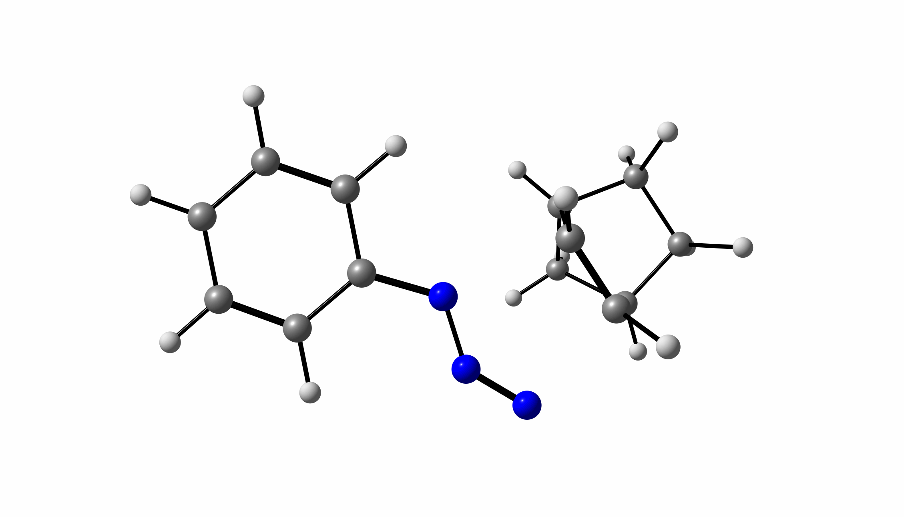
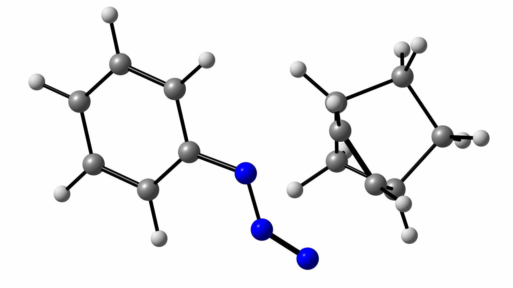

# Transition State (TS) Finding Tutorial

!!! note "Schema note"
    The YAML excerpts on this page are abbreviated for illustration. For the authoritative schema (`sample:`, `input:`, `options:` blocks, …) see the [main schema page](../index.md) and the example in [examples/quickstart/input.yaml](https://github.com/sterling-group/ChemRefine/blob/main/examples/quickstart/input.yaml).


This tutorial demonstrates how to use **ChemRefine** to locate and validate **transition states (TS)** using a stepwise pipeline that combines a **PES scan, optimizations, and normal-mode sampling**.

---

## Overview

Transition states are critical for understanding chemical reactivity and kinetics.  
ChemRefine automates TS exploration with the following workflow:

1. **PES Scan:** Explore bond distances/angles to identify high-energy regions.  
2. **TS Optimization (Top 5):** Optimize the five highest-energy structures from the PES scan.  
3. **Normal-Mode Sampling:** Run the frequency analysis and displace along the imaginary mode, keeping geometries with exactly one imaginary mode (`nms: true`, `target: ts`).  
4. **Final SP Calculation:** Compute the single-point energy on the corrected TS structure.  

---

## Prerequisites

- Installed **ChemRefine** (see [Installation Guide](../user-guide/installation.md))  
- Access to an **ORCA executable**  
- Example input (`input.yaml`) from this tutorial folder  
- Initial structure (`step1.xyz`)  

---

## Input Files

We start with an initial structure located in the templates folder:

- 📄 [View input.yaml](https://github.com/sterling-group/ChemRefine/blob/main/examples/tutorials/transition_state/input.yaml)  
- 📄 [View step1.xyz](https://github.com/sterling-group/ChemRefine/blob/main/examples/tutorials/transition_state/step1.xyz)  

 ## Orca Input Files

You can find the ORCA input files [here](https://github.com/sterling-group/ChemRefine/tree/main/examples/tutorials/transition_state/templates)

### Interactive 3D Viewer

<div id="viewer" style="width: 100%; height: 400px; position: relative;"></div>

<script src="https://3Dmol.org/build/3Dmol-min.js"></script>
<script>
  let viewer = $3Dmol.createViewer("viewer", { backgroundColor: "white" });

  fetch("https://raw.githubusercontent.com/sterling-group/ChemRefine/main/examples/tutorials/transition_state/step1.xyz")
    .then(r => r.text())
    .then(data => {
      viewer.addModel(data, "xyz");   // force XYZ format
      viewer.setStyle({}, {stick:{radius:0.15}, sphere:{scale:0.25}});
      viewer.zoomTo();
      viewer.render();
    })
    .catch(err => console.error("Could not load XYZ:", err));
</script>

---

## YAML Configuration

➡️ [examples/tutorials/transition_state/input.yaml](https://github.com/sterling-group/ChemRefine/blob/main/examples/tutorials/transition_state/input.yaml)

The scan coordinates and any geometry constraints live in the step's ORCA `.inp`
template (e.g. a `%geom Scan ... end` block), not in the YAML.

Example content (excerpt):

```yaml
template_dir: ./templates
scratch_dir: /scratch/
output_dir: ./outputs
executables: { orca: /orca/orca_6_1_0_avx2/orca }

charge: 0
multiplicity: 1

input: ./step1.xyz

steps:
  # Step 1 — PES scan; keep the highest-energy frames as TS guesses.
  - step: 1
    operation: pes
    engine: orca
    sample: { method: max, count: 5 }

  # Step 2 — optimise the guesses.
  - step: 2
    operation: opt_sp
    engine: orca
    sample: { method: min, count: 5 }

  # Step 3 — normal-mode sampling: frequency analysis + imaginary-mode
  # displacement, keeping exactly one imaginary mode (a first-order saddle).
  - step: 3
    operation: opt_sp
    engine: orca
    nms: true
    options: { target: ts, displacement_value: 1.0 }
    sample: { method: min, count: 3 }

  # Step 4 — final single point on the corrected TS.
  - step: 4
    operation: opt_sp
    engine: orca
    sample: { method: min, count: 1 }
```

---

## How to Run

Before running ChemRefine, ensure that:

- The **ChemRefine environment** is activated  
- The **ORCA executable** is in your `PATH`  
- The **template directory** (`./templates/`) is set up  
- The **input structure file** (e.g., `step1.xyz`) is prepared  

### Option 1: Run from the Command Line

```bash
chemrefine run input.yaml --maxcores <N>
```

Here `<N>` is the maximum number of simultaneous jobs.  

### Option 2: Run with SLURM

On HPC systems with SLURM, the same command submits each calculation as its own job
(`dispatch: auto` detects `sbatch`; no wrapper script is needed):

```bash
chemrefine run input.yaml
```


---

## Expected Outputs

- **PES scan geometries** in `outputs/step1/`  
- **Top 5 optimized candidates** in `outputs/step2/`  
- **Normal-mode-sampled (corrected) TS geometries** in `outputs/step3/`  
- **Final single-point energy** in `outputs/step4/`  

Each directory contains `.out` logs, `.xyz` geometries, and summary files.  

---

## Notes & Tips

- Increase the PES scan resolution for difficult reactions.  
- Ensure only **one imaginary frequency** is present for a valid TS.  
- Use `nms: true` with `target: ts` on the optimisation step to remove spurious modes.  
- Always double-check `.xyz` files to confirm correct TS geometry.  

### Identifying Good vs Bad Imaginary Modes

ChemRefine helps distinguish **spurious imaginary modes** (bad TS guesses) from **true transition states**.  

- ❌ Bad imaginary frequency:  
  

- ✅ Corrected good imaginary frequency:  
  
