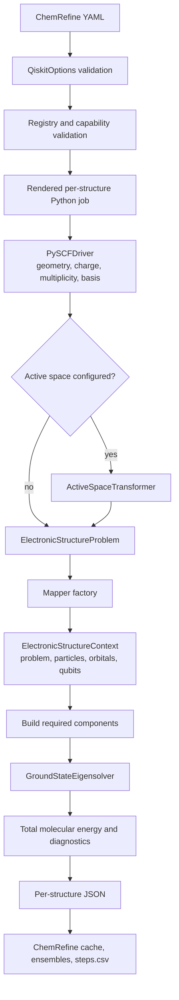
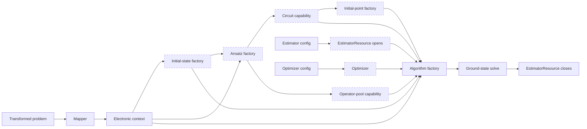
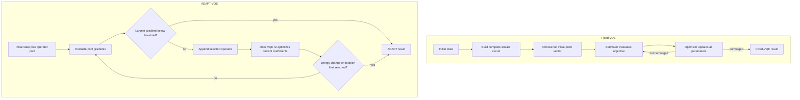

# Qiskit ground-state calculations

ChemRefine's `qiskit` engine runs modular electronic-structure ground-state
calculations with Qiskit Nature. A step chooses the mapper, algorithm, ansatz,
initial state, estimator, optimizer, and initial point independently. Changing
from exact diagonalization to VQE or ADAPT-VQE is therefore a configuration
change, not a new step template.

The built-in workflow is intended for small active spaces, algorithm studies,
and reproducible local simulation. It currently performs **single-point energy
calculations**. It does not optimize geometries or return nuclear gradients.

## Install and run the example

Install the optional stack in the current environment:

```bash
pip install "chemrefine[qiskit]"
# Add Aer when selecting aer_statevector or aer_shots:
pip install "chemrefine[qiskit-aer]"
```

Alternatively, keep it in an isolated ChemRefine-managed environment:

```bash
chemrefine backends install qiskit
# Or install the Aer-capable environment:
chemrefine backends install qiskit-aer
chemrefine backends list
```

The `[qiskit]` extra installs compatible Qiskit, Qiskit Nature, Qiskit
Algorithms, and PySCF versions. `[qiskit-aer]` adds the compatible CPU Aer
distribution. See [Installation](installation.md#qiskit-nature) for the exact
supported ranges, source-install commands, and separate Linux GPU-package
guidance. ChemRefine resolves exact/reference/basic steps to the `qiskit`
managed backend and Aer steps to `qiskit-aer`.

A complete H2 VQE example is shipped at
`examples/tutorials/qiskit_sp/`:

```bash
cd examples/tutorials/qiskit_sp
chemrefine run input.yaml --dry-run
chemrefine run input.yaml
# Aer variants (after installing chemrefine[qiskit-aer]):
chemrefine run aer_statevector.yaml
chemrefine run aer_shots.yaml
```

The important files are:

```text
examples/tutorials/qiskit_sp/
├── input.yaml
├── aer_statevector.yaml
├── aer_shots.yaml
├── h2.xyz
└── templates/
    ├── step1.py
    └── cpu.slurm.header
```

`templates/step1.py` is deliberately thin:

```python
import json

from chemrefine.engines.qiskit.workflow import run_job

result = run_job(
    "$XYZ_PATH",
    charge=int("$CHARGE"),
    multiplicity=int("$MULTIPLICITY"),
    options=json.loads("$QISKIT_OPTIONS_JSON"),
)

energy_hartree = result.energy_hartree
engine_metadata = result.metadata
```

The scientific choices belong in YAML. Keep this template unless you are
registering project-specific components or deliberately changing the output
contract.

## How the workflow is assembled

ChemRefine validates the complete component graph before a job is submitted.
The rendered worker then builds the electronic problem and constructs only the
components required by the selected algorithm.



The active-space transformer does not replace the electronic calculation with
only a mean-field energy. PySCF first supplies molecular orbitals and electronic
integrals. Qiskit Nature then folds the inactive-space contribution into the
transformed Hamiltonian's constants and exposes the chosen active orbitals to
the quantum solver. ChemRefine reports `result.total_energies[0]`, which includes
the active-space and nuclear-repulsion constants.

### Component dependencies and lifetimes

Every component has a narrow construction contract. The estimator is a managed
resource so a future provider implementation can open a session before solver
assembly and close it reliably afterward.



The dashed components are conditional:

- `exact` builds none of the variational components.
- `vqe` requires an estimator, optimizer, fixed circuit, and initial point.
- `adapt_vqe` requires an estimator, optimizer, initial state, and operator
  pool. It does not use the fixed-circuit initial-point component.

Backend-based estimators attach a preset transpiler to their resource so the
ansatz is compiled for the selected simulator before evaluation. This applies
to `basic_backend`, `aer_statevector`, and `aer_shots`.

## Component selection syntax

A component with no custom options can use a short name:

```yaml
algorithm: vqe
optimizer: slsqp
```

Use the expanded form when it has options:

```yaml
estimator:
  name: statevector
  options:
    default_precision: 0.0
    seed: 1234
```

Names are normalized to lowercase and hyphens become underscores, so
`adapt-vqe` and `adapt_vqe` resolve to the same key. Options are strict: an
unknown component, unknown option, or incompatible algorithm/ansatz pair fails
before submission.

The top-level Qiskit options are:

| Key | Default | Meaning |
| --- | --- | --- |
| `basis` | `sto-3g` | PySCF orbital basis passed to `PySCFDriver`. |
| `active_space` | `null` | Optional `{electrons, orbitals}` reduction applied before mapper construction. `electrons` may be a total integer or `[n_alpha, n_beta]`. |
| `mapper` | `jordan_wigner` | Fermion-to-qubit mapping component. |
| `algorithm` | `exact` | Minimum-eigensolver algorithm component. |
| `ansatz` | `uccsd` | Fixed circuit and/or adaptive operator-pool provider. |
| `initial_state` | `hartree_fock` | Circuit prepended to a variational ansatz or used as ADAPT's starting state. |
| `estimator` | `statevector` | Qiskit V2 estimator implementation. |
| `optimizer` | `slsqp` | Classical optimizer for VQE's parameters. |
| `initial_point` | `zeros` | Fixed-VQE parameter initialization. |
| `cores` | `1` | Per-structure CPU allocation. Aer also uses this as its maximum parallel-thread count. |
| `device` | `cpu` | Shared engine option. Use `cuda` only with an Aer estimator in a Linux environment containing the compatible `qiskit-aer-gpu` package; it also makes ChemRefine request GPU resources. |
| `backend_python` | `null` | Explicit backend interpreter override. Normally let ChemRefine resolve `qiskit` or `qiskit-aer` from the selected estimator. |

The ChemRefine YAML loader translates the older flat pair `active_electrons` /
`active_orbitals` for compatibility. New configurations should use
`active_space`; direct `QiskitOptions` and `run_job` callers must use the
canonical nested form.
ChemRefine rejects totals above two electrons per spatial orbital and rejects
alpha or beta populations larger than the spatial-orbital count.

## Built-in components

### Algorithms

| Name | Options | Required artifacts | Notes |
| --- | --- | --- | --- |
| `exact` | none | mapper/problem | Uses `NumPyMinimumEigensolver`. ChemRefine filters the eigenspectrum to the configured particle number and spin `S(S+1)`, including open-shell multiplicities. Exponential memory and runtime restrict it to small qubit Hamiltonians. |
| `vqe` | none | estimator, optimizer, circuit, initial point | Optimizes one fixed parameterized circuit. The ansatz must have at least one parameter. |
| `adapt_vqe` | `gradient_threshold=1e-5`, `eigenvalue_threshold=1e-5`, `max_iterations=null`, `reps=1` | estimator, optimizer, operator pool, initial state | Grows the circuit one selected operator at a time and runs an inner VQE after each addition. `reps` is intentionally restricted to `1` for the supported Qiskit Algorithms version. |

`max_iterations: null` leaves the ADAPT outer loop unbounded. In production,
set a finite limit appropriate to the pool size and compute budget.

### Mappers

| Name | Options | Notes |
| --- | --- | --- |
| `jordan_wigner` | none | Direct Jordan-Wigner mapping. STO-3G H2 uses four qubits. |
| `parity` | `two_qubit_reduction=true` | With reduction enabled, ChemRefine passes the **transformed** problem's particle tuple to `ParityMapper`; STO-3G H2 uses two qubits. Set `false` to keep the unreduced parity mapping. |

The mapper is constructed after active-space transformation. This ordering is
essential: parity reduction chooses a symmetry sector from the active particle
counts, not the original molecule's counts.

### Initial states

| Name | Options | Notes |
| --- | --- | --- |
| `hartree_fock` | none | Builds Qiskit Nature's mapped Hartree-Fock occupation for the active problem. This is the normal choice for UCCSD. |
| `zero` | none | An all-zero computational-basis circuit with the mapped Hamiltonian's qubit count. Useful for suitable hardware-efficient circuits; it is generally not a meaningful reference for UCCSD. |

### Ansatze and operator pools

| Name | Capabilities | Options |
| --- | --- | --- |
| `uccsd` | fixed circuit, operator pool | `reps=1`, `generalized=false`, `preserve_spin=true`, `include_imaginary=false` |
| `efficient_su2` | fixed circuit only | `reps=2`, `entanglement=reverse_linear`, `su2_gates=[ry, rz]`, `skip_final_rotation_layer=false`, `flatten=true` |

`efficient_su2` cannot be used with `adapt_vqe` because it does not supply an
operator pool. UCCSD supplies both forms: VQE consumes the completed UCCSD
circuit, while ADAPT consumes its mapped excitation generators. For ADAPT,
`ansatz.options.reps` must remain `1`; repetitions describe the unused fixed
circuit, not the operator pool.

UCCSD with `preserve_spin: true` preserves alpha and beta populations. A
hardware-efficient circuit such as EfficientSU2 generally does not preserve
particle number or spin, so its variational search can leave the intended
chemistry sector. Use it deliberately and validate against an exact result when
the active space is small enough.

### Estimators

All four built-ins implement Qiskit's V2 estimator interface, but they model
different execution semantics:

| Name | Options | Execution model |
| --- | --- | --- |
| `statevector` | `default_precision=0.0`, `seed=null` | Qiskit's lightweight reference statevector estimator. Precision `0` gives exact expectation values for unitary circuits. A positive precision adds Gaussian perturbations; `seed` makes those perturbations reproducible. It does **not** perform finite-shot sampling. |
| `basic_backend` | `backend_name=basic_simulator`, `default_precision=0.015625`, `abelian_grouping=true`, `seed_simulator=null`, `optimization_level=1` | Wraps Qiskit's bundled `BasicSimulator` with `BackendEstimatorV2`. Precision must be positive and implies roughly `ceil(1 / precision^2)` shots per grouped measurement. This is an ideal, dependency-light shot simulator. |
| `aer_statevector` | `default_precision=0.0`, `seed_simulator=null`, `simulation_precision=double`, `optimization_level=1`, `seed_transpiler=null` | Uses Aer `EstimatorV2` with an Aer statevector backend. Precision `0` saves exact expectation values. A positive precision adds Gaussian noise to those values; it still does **not** sample shots. |
| `aer_shots` | `method=automatic`, `default_precision=0.015625`, `abelian_grouping=true`, `seed_simulator=null`, `optimization_level=1`, `seed_transpiler=null`, `simulation_precision=double`, `noise_model=null` | Wraps `AerSimulator` with `BackendEstimatorV2`, so positive precision produces finite-shot estimates (roughly `ceil(1 / precision^2)` shots). It supports Aer simulation methods and an optional serialized Aer `NoiseModel` mapping. |

Use `statevector` for a small, deterministic reference with minimal simulator
machinery; use `aer_statevector` when Aer's simulator controls or GPU support
matter. Use `basic_backend` for a lightweight ideal shot test and `aer_shots`
for Aer shot sampling or an Aer noise model. `simulation_precision` controls
Aer floating-point arithmetic (`single` or `double`); it is distinct from the
estimator's statistical `default_precision`.

The allowed `aer_shots.options.method` values are `automatic`, `statevector`,
`density_matrix`, `matrix_product_state`, and `tensor_network`. ChemRefine
checks the installed Aer build before starting the solver. `tensor_network`
requires `device: cuda`; `matrix_product_state` is CPU-only in this component
graph.

For `aer_shots`, `noise_model` must be the mapping returned by
`NoiseModel.to_dict(serializable=True)`, not a Python object or file path. A
non-null model changes the simulated gates/readout only as encoded in that
mapping. It does not automatically reproduce a device's topology, calibration
drift, queueing, control stack, or other hardware behavior. Even noisy Aer is a
simulator, not a quantum-computer submission.

At the default shot precision, the target is approximately 4096 shots because
`ceil(1 / 0.015625^2) = 4096`. Smaller positive precision requests more shots;
for example, `0.01` implies about 10,000. The actual work can be higher when
the observable is split into multiple commuting groups.

### Optimizers

| Name | Options | Practical use |
| --- | --- | --- |
| `slsqp` | `maxiter=100`, `ftol=1e-6`, `disp=false` | Efficient default for smooth, deterministic statevector objectives. |
| `cobyla` | `maxiter=1000`, `rhobeg=1.0`, `tol=null`, `disp=false` | Derivative-free local optimization. `maxiter` is effectively a function-evaluation budget in SciPy's COBYLA implementation. |
| `spsa` | `maxiter=100`, `blocking=false`, `trust_region=false`, `learning_rate=null`, `perturbation=null`, `second_order=false`, `seed=null` | Noise-tolerant stochastic optimization, usually paired with a shot-based estimator. |

SPSA's `learning_rate` and `perturbation` must be specified together or both
omitted. If both are omitted, Qiskit calibrates them with additional objective
calls that are not reflected by `maxiter`. `seed` controls Qiskit's global SPSA
perturbation generator inside the per-structure worker process.

### Initial points

| Name | Options | Notes |
| --- | --- | --- |
| `zeros` | none | One zero per fixed-circuit parameter. This is the Hartree-Fock point when UCCSD is built on the Hartree-Fock initial state. |
| `random` | `seed=null`, `scale=0.1` | Uniform samples in `[-scale, scale]`, generated independently for the fixed circuit's parameter count. |

Initial points apply to fixed VQE only. ADAPT initializes the newly selected
operator coefficient internally and retains optimized coefficients as it grows;
it does not consume this component.

## VQE versus ADAPT-VQE

VQE optimizes every parameter in a circuit whose structure is fixed before the
first estimator call. ADAPT-VQE begins with the initial state, measures
gradients for an operator pool, appends the most important operator, and then
uses VQE to re-optimize the circuit built so far.



The trade-off is structural:

| Question | VQE | ADAPT-VQE |
| --- | --- | --- |
| Circuit structure | Fixed up front | Grows during the run |
| Ansatz requirement | Parameterized circuit | Non-empty operator pool |
| Initial point | Explicit component | Managed internally as the circuit grows |
| Classical optimization | One optimizer run | One inner VQE per accepted operator |
| Estimator workload | Objective evaluations | Pool gradients plus repeated inner VQEs |
| Typical use | Known compact ansatz | Discovering a problem-specific compact ansatz |

## Complete configurations

Each example below is runnable with the shipped `h2.xyz` and
`templates/step1.py`.

### Exact diagonalization

Use this as a reference for small active spaces. Variational components retain
their harmless defaults in the validated job specification but are not built.

```yaml
template_dir: ./templates
output_dir: ./outputs_exact
input: ./h2.xyz

charge: 0
multiplicity: 1
max_cores: 4
dispatch: local

steps:
  - step: 1
    name: exact
    engine: qiskit
    operation: sp
    template: step1.py
    options:
      basis: sto-3g
      active_space:
        electrons: 2
        orbitals: 2
      mapper:
        name: parity
        options:
          two_qubit_reduction: true
      algorithm:
        name: exact
      cores: 1
```

### Fixed UCCSD VQE

```yaml
template_dir: ./templates
output_dir: ./outputs_vqe
input: ./h2.xyz

charge: 0
multiplicity: 1
max_cores: 4
dispatch: local

steps:
  - step: 1
    name: vqe
    engine: qiskit
    operation: sp
    template: step1.py
    options:
      basis: sto-3g
      active_space:
        electrons: 2
        orbitals: 2
      mapper:
        name: jordan_wigner
      algorithm:
        name: vqe
      initial_state:
        name: hartree_fock
      ansatz:
        name: uccsd
        options:
          reps: 1
          generalized: false
          preserve_spin: true
          include_imaginary: false
      estimator:
        name: statevector
        options:
          default_precision: 0.0
          seed: 1234
      optimizer:
        name: slsqp
        options:
          maxiter: 500
          ftol: 1.0e-9
          disp: false
      initial_point:
        name: zeros
      cores: 1
```

### UCCSD-pool ADAPT-VQE

```yaml
template_dir: ./templates
output_dir: ./outputs_adapt
input: ./h2.xyz

charge: 0
multiplicity: 1
max_cores: 4
dispatch: local

steps:
  - step: 1
    name: adapt
    engine: qiskit
    operation: sp
    template: step1.py
    options:
      basis: sto-3g
      active_space:
        electrons: 2
        orbitals: 2
      mapper:
        name: parity
        options:
          two_qubit_reduction: true
      algorithm:
        name: adapt_vqe
        options:
          gradient_threshold: 1.0e-6
          eigenvalue_threshold: 1.0e-8
          max_iterations: 50
          reps: 1
      initial_state:
        name: hartree_fock
      ansatz:
        name: uccsd
        options:
          reps: 1
          generalized: false
          preserve_spin: true
          include_imaginary: false
      estimator:
        name: statevector
        options:
          default_precision: 0.0
          seed: 1234
      optimizer:
        name: slsqp
        options:
          maxiter: 500
          ftol: 1.0e-9
      cores: 1
```

There is no `initial_point` block because ADAPT does not consume it.

### Shot-based `basic_backend` VQE

Use SPSA for this noisy objective. The simulator seed and SPSA seed control
different random processes and should both be set.

```yaml
template_dir: ./templates
output_dir: ./outputs_basic_backend
input: ./h2.xyz

charge: 0
multiplicity: 1
max_cores: 4
dispatch: local

steps:
  - step: 1
    name: shot_vqe
    engine: qiskit
    operation: sp
    template: step1.py
    options:
      basis: sto-3g
      active_space:
        electrons: 2
        orbitals: 2
      mapper:
        name: jordan_wigner
      algorithm:
        name: vqe
      initial_state:
        name: hartree_fock
      ansatz:
        name: uccsd
        options:
          reps: 1
          preserve_spin: true
      estimator:
        name: basic_backend
        options:
          backend_name: basic_simulator
          default_precision: 0.015625
          abelian_grouping: true
          seed_simulator: 1234
          optimization_level: 1
      optimizer:
        name: spsa
        options:
          maxiter: 300
          blocking: false
          trust_region: false
          learning_rate: 0.05
          perturbation: 0.10
          second_order: false
          seed: 1234
      initial_point:
        name: zeros
      cores: 1
```

### Exact-expectation `aer_statevector` VQE

This is still a simulator-only calculation. With `default_precision: 0.0`,
Aer evaluates saved expectation values without shot sampling.

```yaml
template_dir: ./templates
output_dir: ./outputs_aer_statevector
input: ./h2.xyz

charge: 0
multiplicity: 1
max_cores: 4
dispatch: local

steps:
  - step: 1
    name: aer_statevector_vqe
    engine: qiskit
    operation: sp
    template: step1.py
    options:
      basis: sto-3g
      active_space:
        electrons: 2
        orbitals: 2
      mapper:
        name: jordan_wigner
      algorithm:
        name: vqe
      initial_state:
        name: hartree_fock
      ansatz:
        name: uccsd
        options:
          reps: 1
          generalized: false
          preserve_spin: true
          include_imaginary: false
      estimator:
        name: aer_statevector
        options:
          default_precision: 0.0
          seed_simulator: 1234
          simulation_precision: double
          optimization_level: 1
          seed_transpiler: 1234
      optimizer:
        name: slsqp
        options:
          maxiter: 500
          ftol: 1.0e-9
          disp: false
      initial_point:
        name: zeros
      device: cpu
      cores: 4
```

### Finite-shot `aer_shots` VQE

This configuration uses ideal Aer shot sampling. Set `noise_model` to a
serialized mapping only when you have chosen and recorded a defensible noise
model.

```yaml
template_dir: ./templates
output_dir: ./outputs_aer_shots
input: ./h2.xyz

charge: 0
multiplicity: 1
max_cores: 4
dispatch: local

steps:
  - step: 1
    name: aer_shot_vqe
    engine: qiskit
    operation: sp
    template: step1.py
    options:
      basis: sto-3g
      active_space:
        electrons: 2
        orbitals: 2
      mapper:
        name: jordan_wigner
      algorithm:
        name: vqe
      initial_state:
        name: hartree_fock
      ansatz:
        name: uccsd
        options:
          reps: 1
          generalized: false
          preserve_spin: true
          include_imaginary: false
      estimator:
        name: aer_shots
        options:
          method: automatic
          default_precision: 0.015625
          abelian_grouping: true
          seed_simulator: 1234
          optimization_level: 1
          seed_transpiler: 1234
          simulation_precision: double
          noise_model: null
      optimizer:
        name: spsa
        options:
          maxiter: 300
          blocking: false
          trust_region: false
          learning_rate: 0.05
          perturbation: 0.10
          second_order: false
          seed: 1234
      initial_point:
        name: zeros
      device: cpu
      cores: 4
```

To prepare a serialized noise-model mapping, construct it with the same pinned
Aer version used for the run and print its JSON-compatible representation. For
example:

```python
import yaml
from qiskit_aer.noise import NoiseModel, depolarizing_error

model = NoiseModel()
model.add_all_qubit_quantum_error(depolarizing_error(0.01, 2), ["cx"])
print(yaml.safe_dump(model.to_dict(serializable=True), sort_keys=False))
```

Paste the resulting mapping below `noise_model:` with normal YAML indentation.
Keep the code or source calibration alongside the configuration: a serialized
model is not self-justifying evidence that it represents a particular device.

To use Aer GPU simulation, install the compatible Linux GPU distribution, set
`device: cuda`, and give the run a nonzero GPU budget (for local dispatch,
`max_gpus: 1`; under SLURM, provide a GPU-requesting header). Do not set
`device: cuda` for `statevector` or `basic_backend`; ChemRefine rejects that
component/device mismatch before submission.

## Output and metadata

The normal ChemRefine outputs remain the source for downstream pipeline data:

- `outputs/steps.csv` contains the reported total molecular energy.
- `outputs/stepN/stepN_ensemble.xyz` and `stepN_survivors.xyz` carry the ranked
  structures and energies.
- `outputs/stepN/<id>/stepN_<id>.result.json` is the normalized ChemRefine
  result.

The shipped Qiskit template also assigns `engine_metadata`, so the raw script
output `outputs/stepN/<id>/stepN_<id>.json` contains an additional block:

```json
{
  "energy_hartree": -1.1373060357,
  "engine_metadata": {
    "components": {
      "mapper": {"name": "jordan_wigner", "options": {}},
      "algorithm": {"name": "exact", "options": {}},
      "ansatz": {
        "name": "uccsd",
        "options": {
          "reps": 1,
          "generalized": false,
          "preserve_spin": true,
          "include_imaginary": false
        }
      },
      "initial_state": {"name": "hartree_fock", "options": {}},
      "estimator": {
        "name": "statevector",
        "options": {"default_precision": 0.0, "seed": null}
      },
      "optimizer": {
        "name": "slsqp",
        "options": {"maxiter": 100, "ftol": 1e-6, "disp": false}
      },
      "initial_point": {"name": "zeros", "options": {}}
    },
    "basis": "sto-3g",
    "device": "cpu",
    "cores": 1,
    "active_space": {"electrons": 2, "orbitals": 2},
    "num_spatial_orbitals": 2,
    "num_particles": [1, 1],
    "num_qubits": 4,
    "evaluations": [],
    "solver": {}
  }
}
```

The generic structure parser intentionally copies only canonical chemistry
fields into `<id>.result.json`; detailed `engine_metadata` remains in the raw
Qiskit `.json` sidecar.

`components` contains the resolved name and fully defaulted options for every
component category, including components that an exact solve validates but does
not build. `device` and `cores` record the shared execution settings passed to
provider-backed estimators.
`solver` includes whichever fields the selected Qiskit result exposes:

- `cost_function_evals`
- `num_iterations`
- `optimal_point`
- `optimal_value`
- `termination_criterion`

Every variational callback record contains:

| Field | Meaning |
| --- | --- |
| `evaluation` | ChemRefine's globally monotonic, one-based callback index. |
| `inner_run` | Fixed VQE is `1`; ADAPT increments it when a new inner VQE starts. |
| `algorithm_evaluation` | Qiskit's local counter, which resets for each ADAPT inner VQE. |
| `objective_value_hartree` | Expectation value of the mapped electronic Hamiltonian. It excludes nuclear repulsion and active-space constants. |
| `metadata` | JSON-safe estimator metadata, such as target precision or shot count. |

For ADAPT, `solver.cost_function_evals` describes the retained inner VQE result,
not total adaptive work. Use the length of `evaluations` for the number of
objective callback records, and remember that pool-gradient estimator calls are
additional work.

Qiskit Algorithms 0.4 does not reliably pass the complete parameter vector to
its VQE callback, so ChemRefine intentionally does not claim to record a
parameter trajectory. The final `solver.optimal_point` remains available.

## Reproducibility checklist

For repeatable local comparisons:

1. Pin the ChemRefine environment, including Qiskit package versions.
2. Keep the geometry, charge, multiplicity, basis, active space, mapper, and
   every component option in version control.
3. Use `initial_point: zeros`, or set `initial_point.options.seed` for `random`.
4. Set `estimator.options.seed` for the reference statevector estimator's
   precision perturbations. Set `seed_simulator` for Aer perturbations or shot
   sampling, and set `seed_transpiler` for reproducible Aer compilation.
5. Set `optimizer.options.seed` when using SPSA.
6. Record estimator precision, Aer method/numerical precision, any serialized
   noise model, and optimizer stopping tolerances; each can
   materially change a variational result.
7. Preserve the rendered `stepN_<id>.py` and raw `.json` output that ChemRefine
   leaves in each structure directory.
8. Save `python -m pip freeze` or the managed environment lock alongside
   published results. Package versions are not currently copied into
   `engine_metadata`.

The `statevector` or `aer_statevector` estimator with
`default_precision: 0.0`, a deterministic initial point, and SLSQP is
deterministic for the built-in unitary circuits. For a shot-based estimator,
identical seeds improve reproducibility but do not turn a finite-shot answer
into an exact one.

## Extending the registries

The assembly layer uses seven registries:

```python
from chemrefine.engines.qiskit.registry import (
    ALGORITHMS,
    ANSATZE,
    ESTIMATORS,
    INITIAL_POINTS,
    INITIAL_STATES,
    MAPPERS,
    OPTIMIZERS,
)
```

Each registry entry pairs a strict Pydantic options model with a builder. Ansatz
entries also declare the artifacts they can provide, while algorithm entries
declare the artifacts they require. This is what produces a configuration error
for `adapt_vqe` plus `efficient_su2` before a calculation starts.

| Registry | Builder receives | Builder returns |
| --- | --- | --- |
| `MAPPERS` | `options`, transformed `problem` | Qiskit Nature mapper |
| `INITIAL_STATES` | `options`, `ElectronicStructureContext` | `QuantumCircuit` |
| `ANSATZE` | `options`, context, initial state | `AnsatzArtifacts(circuit=..., operator_pool=...)` |
| `ESTIMATORS` | `options`, top-level `device`, `cores` | `EstimatorResource` containing a V2 estimator |
| `OPTIMIZERS` | `options` | Qiskit Algorithms optimizer |
| `INITIAL_POINTS` | `options`, ansatz artifacts | NumPy parameter vector |
| `ALGORITHMS` | `options`, context, assembled components | `AlgorithmArtifacts(solver=...)` |

For example, an in-tree fixed-circuit ansatz can be registered as follows:

```python
from pydantic import BaseModel, ConfigDict, Field

from chemrefine.engines.qiskit.context import (
    AnsatzArtifacts,
    ElectronicStructureContext,
)
from chemrefine.engines.qiskit.registry import ANSATZE


class RealAmplitudesOptions(BaseModel):
    model_config = ConfigDict(frozen=True, extra="forbid")

    reps: int = Field(2, ge=1)
    entanglement: str = "reverse_linear"


@ANSATZE.register(
    "real_amplitudes",
    RealAmplitudesOptions,
    capabilities=frozenset({"circuit"}),
)
def build_real_amplitudes(
    *,
    options: RealAmplitudesOptions,
    context: ElectronicStructureContext,
    initial_state: object,
) -> AnsatzArtifacts:
    from qiskit.circuit.library import RealAmplitudes

    circuit = RealAmplitudes(
        context.num_qubits,
        reps=options.reps,
        entanglement=options.entanglement,
        initial_state=initial_state,
        flatten=True,
    )
    return AnsatzArtifacts(circuit=circuit)
```

Then YAML can select it with `ansatz: real_amplitudes` for VQE.

!!! important "Registration must happen in both processes"

    ChemRefine validates Qiskit component names in the orchestrator and builds
    them in the backend worker. A component module must therefore be imported in
    both processes. For an in-tree extension, add its import to
    `chemrefine.engines.qiskit.components.__init__` and install that source. A
    third-party module must arrange equivalent early imports in both processes;
    automatic entry-point discovery is not currently implemented. Importing a
    custom module only from `templates/step1.py` is too late for the
    orchestrator's pre-submission validation.

Estimator extensions should return `EstimatorResource`. Put provider session
cleanup in its `close` callback, and provide a compatible transpiler when the
backend accepts only transpiled/ISA circuits. Keep provider credentials in the
provider's normal authentication or environment mechanism, not in YAML.
When an estimator needs a separately installed provider, declare it on the
registry entry instead of hard-coding it in the engine:

```python
from chemrefine.engines.api import BackendRequirement
from chemrefine.engines.qiskit.context import EstimatorResource
from chemrefine.engines.qiskit.registry import ESTIMATORS

@ESTIMATORS.register(
    "provider_estimator",
    ProviderEstimatorOptions,
    backend_requirement=BackendRequirement(
        extra="qiskit-provider",
        import_name="provider_module",
    ),
)
def build_provider_estimator(*, options: ProviderEstimatorOptions) -> EstimatorResource:
    ...
```

Preflight selection, managed-environment discovery, and the worker interpreter
are derived from that declaration whenever the chosen algorithm consumes an
estimator.

## Compatibility and limitations

- The supported dependency ranges are Qiskit `>=1.4,<2.0`, Qiskit Nature
  `>=0.8,<0.9`, Qiskit Algorithms `>=0.4,<0.5`, and Qiskit Aer
  `>=0.17,<0.18`.
- Exact diagonalization and statevector simulation scale exponentially with
  qubit count. Define a chemically meaningful active space before treating
  either as practical for a larger molecule.
- `adapt_vqe.options.reps` must be `1`. Qiskit Algorithms 0.4 initializes one
  new coefficient per adaptive iteration, while larger repetitions construct
  more parameters and cause a dimension mismatch.
- `adapt_vqe` plus UCCSD also requires `ansatz.options.reps: 1`, because ADAPT
  consumes the base operator pool rather than a repeated fixed circuit.
- A trivial or fully occupied active space can yield a zero-parameter UCCSD
  circuit or an empty pool. ChemRefine rejects these for VQE/ADAPT and suggests
  `exact` or a different ansatz.
- If every ADAPT pool gradient is below the threshold on the first iteration,
  Qiskit raises instead of returning the initial state as a successful adaptive
  result. Tighten `gradient_threshold` or select a better initial state/pool.
- Variational solvers do not use the exact solver's particle/spin filter. Their
  state and ansatz must keep the search in the desired sector when that matters.
- All built-in estimators run locally. The standard `[qiskit-aer]` extra installs
  Aer's CPU distribution. Aer GPU simulation requires Linux, a compatible CUDA
  stack, and the separately installed `qiskit-aer-gpu` distribution.
- An Aer noise model is a classical approximation of specified gate/readout
  errors. No built-in estimator connects to IBM Runtime, opens a provider
  session, uses cloud credentials, or submits to quantum hardware.
- The engine currently returns a single-point energy and the input coordinates.
  It does not provide forces, frequency analysis, geometry optimization, or
  excited states.

## Troubleshooting

| Symptom | Cause and fix |
| --- | --- |
| `backend 'qiskit' is not available` | Install `chemrefine[qiskit]` in the current environment or run `chemrefine backends install qiskit`. |
| `unsupported qiskit ... component` | Check the registered name. Hyphens are normalized, but the component still must be registered before pre-submission validation. |
| `invalid qiskit ... options` | The component options are strict. Remove the unknown key or correct its type/range. |
| `adapt_vqe` requires `operator_pool` | `efficient_su2` supplies only a fixed circuit. Select `uccsd` or register an ansatz/pool provider with the `operator_pool` capability. |
| ADAPT reports an empty operator pool | The active problem has no UCCSD excitations. Use `exact`, enlarge/change the active space, or choose another pool. |
| VQE reports an ansatz with no parameters | The chosen active problem and ansatz produce a fixed state. Use `exact` or a parameterized ansatz. |
| ADAPT says all gradients are below the threshold in the first iteration | The initial state is stationary for the pool at the configured tolerance. Tighten `gradient_threshold`, inspect the pool, or change the initial state. |
| `learning_rate and perturbation must be set together` | Supply both scalar SPSA values or omit both and allow Qiskit's calibration phase. |
| `basic_backend` or `aer_shots` rejects precision `0` | Shot-based `BackendEstimatorV2` requires a positive target precision. Use `statevector` or `aer_statevector` with `default_precision: 0.0` for exact expectations. |
| `aer_statevector` looks noisy with positive precision | Aer `EstimatorV2` adds Gaussian perturbations at positive precision; it does not switch to finite shots. Use `aer_shots` for shot sampling or set `default_precision: 0.0` for exact saved expectation values. |
| `aer_shots` rejects `noise_model` | Pass the JSON-compatible mapping returned by the pinned Aer version's `NoiseModel.to_dict(serializable=True)`, not a `NoiseModel` object, string path, or arbitrary dictionary. |
| `device: cuda` is rejected or Aer reports no GPU device | Select `aer_statevector` or `aer_shots`, run on Linux with a compatible CUDA stack and `qiskit-aer-gpu`, and ensure ChemRefine's local/SLURM GPU allocation is nonzero. The standard `[qiskit-aer]` extra installs CPU Aer. |
| VQE and the final energy differ by a constant | Callback `objective_value_hartree` excludes nuclear-repulsion and active-space constants. Compare the final `energy_hartree` or `steps.csv` value. |
| A larger active-space job exhausts memory | Exact and statevector simulation still scale exponentially in qubit count, including Aer statevector methods on a GPU. Reduce the active space or choose a method whose scaling fits the problem. |
| Results change between SPSA runs | Set the SPSA `seed`, estimator/simulator seed, and initial-point seed; also pin package versions and all tolerances. |
